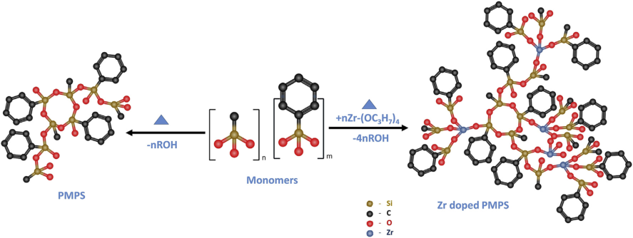
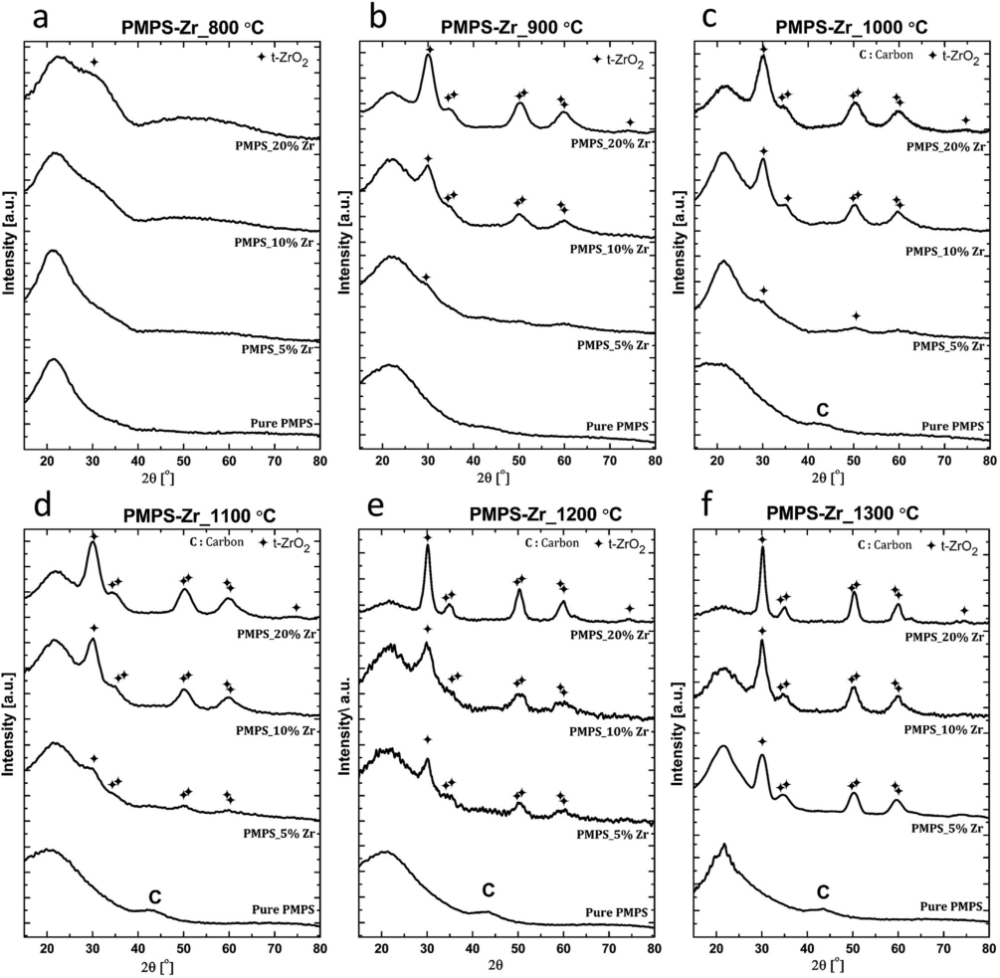
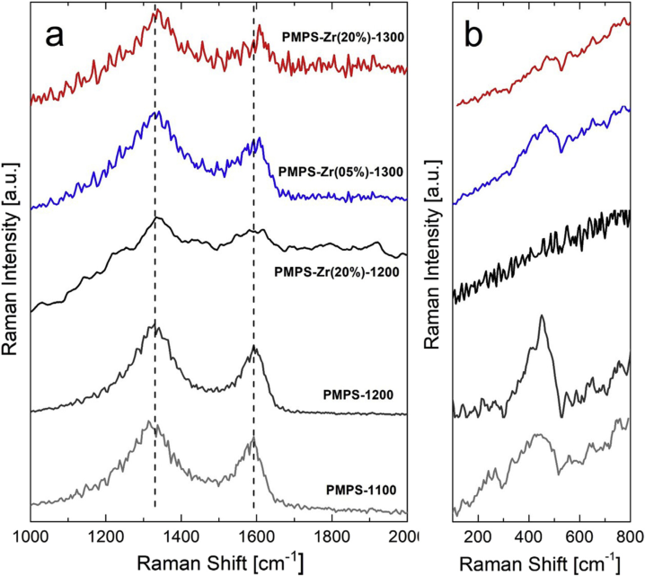
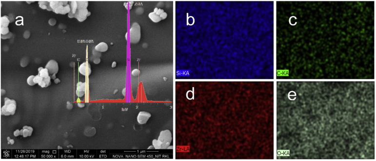
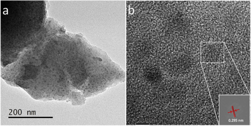

Ceramics International xxx (xxxx) xxx–xxx 

Contents lists available at ScienceDirect 

# Ceramics International 

journal homepage: www.elsevier.com/locate/ceramint 

#### Short communication 

## Phase evolution in Zr-doped preceramic polymer derived SiZrOC hybrids 

### Rahul Anand, Soumya Prakash Sahoo, Bibhuti B. Nayak, Shantanu K. Behera∗ 

Laboratory for New Ceramics, Department of Ceramic Engineering, National Institute of Technology Rourkela, Odisha, 769008, India 

|A R T I C L E I N F O|A B S T R A C T|
|---|---|
|Keywords:|The present work focuses on the phase evolution of SiZrOC ceramic hybrids derived from the doping of Zr in a|
|Polymer derived ceramics |phenyl-containing silsesquioxane based preceramic polymer in the temperature range of 800 °C–1300 °C. A|
|Silicon oxycarbide ZrO2 Nanocrystallites Silsesquioxane|commercially available polymethylphenylsilsesquioxane polymer was doped with 5–20 mol% of Zr (through alkoxide source), and cross-linked. Inert atmosphere pyrolysis of thus produced powders yielded black colored SiZrOC ceramics. It was revealed that the dopants phase separate into t-ZrO2beyond 800 °C. The crystallite size of t-ZrO2 was calculated from the X-ray diffractograms using Scherrer formula. Raman spectroscopy was em- ployed to study the effect of dopant ion on retention of carbon and silica residual phases in the final ceramic hybrid. The crystallites of ZrO2were further analyzed by high resolution transmission electron microscopy. The characterizations of Zr doped SiOxCy ceramic hybrids exhibit potential for coating systems in moderate to high temperature applications.|

##### 1. Introduction 

A special class of materials, known as polymer derived ceramics (PDCs), has been gaining attention for its outstanding high temperature stability, and resistance to thermal shock, creep, crystallization, oxidation, and corrosion [1–7]. PDCs also exhibit interesting electronic properties, including lithium intercalation and supercapacitance [8,9]. Different types of silicon containing preceramic polymers, including polymethylsilsesquioxanes (PMS), polymethylphenylsilsesquioxanes (PMPS), polyhydromethylsiloxane (PHMS), methyltriethoxysilane (MTES), diethoxydimethyl-silane (DEDMS), have been processed to synthesize SiOxCy (generally termed as SiOC) ceramics [2,10–14]. PMS is a silicon rich precursor polymer, whereas PMPS is carbon enriched due to the presence of phenyl containing group in its monomer. The microstructure and phase compositions of the PDCs strongly depend on the preceramic polymer used, and hence influence their properties. Therefore, chemistry and the molecular structure of the preceramic polymer are important parameters for the modification of the properties of PDCs. Earlier research suggests that doping of Al [15], Ti [16,17], Zr [18,19], Hf [20], and B [21] into SiOC enhances its property significantly by altering their nanostructures. Ti modification to the PMPS derived SiOC accelerated SiC phase formation, reduced free carbon phase by formation of TiC and significantly enhanced resistance to oxidation [16]. Furthermore, boron modification to the PDCs derived SiBCN applied on carbon nanotube drastically enhances their thermal stability even in flowing air up to 1000 °C [22,23]. Silicon oxycarbide, 

which is an amorphous single phase ceramic of empirical formula SiOxCy, is composed of nanodomains of SiO2, graphene-like C sheets, and mixed bond tetrahedra of Si–O/C. When the pyrolysis temperature of the ceramic increases, typically more than 1000 °C, the SiO2 phase reacts with free carbon present in the structure to form SiC through carbothermal reduction process. Nevertheless, some amount of free carbon still remains in the ceramic and the amount of such remnant free carbon is dependent on the type of preceramic polymer used. The phase separated free carbon is prone to oxidation in high temperature ambient environment, which leads to mass loss and materials recession. 

The overall objective of the work is to see if incorporation of Zr through a molecular precursor in the SiOC single phase ceramic alters/ reduces the free carbon phase in the ceramic hybrid, so that the resulting ceramic can possess better high temperature stability. Thus, a PMPS polymer was modified at molecular level by varying the quantities of Zr-n-propoxide, followed by crosslinking and pyrolysis in an inert atmosphere, to synthesize Zr incorporated SiOC ceramics (the process is depicted in a schematic in Fig. 1). The phase analysis was performed on the pyrolyzed pure and Zr doped PMPS ceramic powders using X-ray diffractometer. Further, Raman spectroscopy was performed on the specimens to understand the evolution of carbon in the SiOxCy structure. The samples were probed using high resolution transmission electron microscope (HRTEM) to investigate the microstructural evolution in the SiOxCy hybrid. The study is expected to act as a reference to qualify and quantify the effectiveness of dopants on the polymer derived silicon oxycarbide ceramics. 

> ∗ Corresponding author. 

> E-mail address: behera@alum.lehigh.edu (S.K. Behera). 

> https://doi.org/10.1016/j.ceramint.2019.12.196 Received 16 October 2019; Received in revised form 20 December 2019; Accepted 23 December 2019 0272-8842/ © 2019 Published by Elsevier Ltd. 

Please cite this article as: Rahul Anand, et al., Ceramics International, https://doi.org/10.1016/j.ceramint.2019.12.196 

_Ceramics International xxx (xxxx) xxx–xxx_ 

R. Anand, et al. 

Fig. 1. Schematic of the proposed approach of incorporating Zr-alkoxide as a molecular level dopant in the PMPS preceramic polymer. 

##### 2. Experimental 

The preceramic polymer SILRES® H44 (a commercial PMPS) was used, which was obtained from Wacker Silicones, Burghausen, Germany. Zirconium (IV) isopropoxide (Sigma-Aldrich) was used as precursors for Zr doping in the silicon oxycarbide ceramics. The dopant was added into the polymer system in a ratio of dopant ion to silicon. The PMPS polymer was pyrolyzed in air to find out the ceramic yield, which is SiO2. Based on the weight of SiO2 the Si content in the PMPS polymer was calculated. Subsequently, the amount of dopant ion in the polymer was calculated for 5, 10 and 20 mol% of the dopant to Si ion in the polymer. For batch preparation, 20 ml of isopropyl alcohol (IPA) was taken in a glass beaker to which 10 g of PMPS polymer was added. The solution was stirred continuously using a glass rod until a clear solution of the polymer was obtained. The dopant ion precursor was measured in a measuring cylinder and poured into the 10 ml hot isopropanol with constant stirring. This dopant precursor solution was immediately poured into the prepared polymer solution to prevent the formation of metal hydroxides since isopropoxide readily reacts with moisture. The mix was continuously stirred in a magnetic stirrer. 50 μl (0.5 wt%) of triethanolamine was measured in a micro-pipette and added as a cross-linking agent into the mixture and stirred vigorously. The resulting mix was transferred into a glass petri-dish and was kept in an electric oven at 60 °C for drying. Then the dried solid was scrapped off the petri-dish and was thoroughly ground with a mortar and pestle. The ground powders were transferred into an alumina crucible and were cross-linked in a muffle furnace at 350 °C for 2 h. The cured powders were further ground to fine powders in a mill (Spex 8000 M, Spex SamplePrep, Metuchen, NJ, USA). These powders were finally pyrolyzed in an alumina tube furnace with flowing argon atmosphere. Similar to the preparation of the Zr doped PMPS ceramics, the as purchased PMPS polymer powders were cross-linked by addition of the cross-linking agent, triethanolamine, at 350 °C for 2 h in a muffle furnace. The resulting cross-linked powders were pyrolyzed under inert atmosphere at various temperatures. The pyrolysis temperature varied from 800 to 1300 °C at a ramp rate of 3 °C min−1 from room temperature to 1000 °C and 2 °C min−1 for temperature above 1000 °C. 

The pyrolyzed samples of undoped and Zr-doped SiOC were milled and the phases were identified by X-ray diffraction (XRD) technique using X-ray diffractometer (Ultima IV, Rigaku, Japan) with Cu Kα radiation through 2θ range of 15–80° at 20° minute−1 and a step size of 0.05°. The crystallite sizes of the phases were calculated from the X-ray diffractograms using Scherrer formula. Raman analysis was performed to study the effect of Zr incorporation on carbon nanostructures. Micro Raman spectra were obtained on few selected undoped and Zr-doped samples a Raman spectrometer (XMB3000, WITec GmbH, Germany) having an Ar laser with irradiation wavelength of 532 nm. The 

measurements were performed with a confocal microscope (50 × , NA 0.5) with a 100 μm aperture. The laser power is kept in the range of 0.001 mW–2 μW using neutral density (ND) filters. All Raman spectra were scanned 4 times and each lasting for 10 s in 100–2000 cm−1 spectral range. A scanning electron microscope with a field emission gun (SEM, Nova NanoStar, FEI, Eindhoven, NL) was employed to observe the morphology of the particulate ceramics. Energy dispersive X- ray spectrometry (EDX) was done to estimate the bulk composition of the particulates. For transmission electron microscopy (TEM), the powdered samples were homogeneously dispersed in 2-Propanol and a drop of the solution was deposited on a carbon coated copper grid (300 mesh, Ted Pella, USA). The copper grid was allowed to dry under IR lamp. The grid was then placed in the sample holder for analysis. TEM was performed by a 300 kV microscope (FEI, Technai G2 , Eindhoven, NL) with a field emission electron gun. Bright field imaging and high resolution imaging was performed on the prepared samples. For analysis of the TEM micrographs, Gatan Digital Micrograph® software was used. The lattice fringes were calculated applying the fast Fouriertransform (FFT) algorithm on a selected area over the micrograph of the lattice fringes in the crystallite. After computation, the fringe width was measured from the inverse FFT images derived from the micrograph. 

##### 3. Results and discussion 

A series of the X-ray diffractograms was recorded for the undoped SiOC (noted as pure PMPS) and Zr-doped SiOC ceramics (denoted as PMPS_Zr) with varying concentration of Zr (cf. Fig. 2). The diffractograms show that pyrolyzed PMPS up to 900 °C, the sample remains in single amorphous SiOxCy phase (Fig. 2 a-b). However, for the undoped samples pyrolyzed at temperature 1000 °C and above, a broad hump of carbon (JCPDS #73–1665) at Bragg's angle 43° is observed (Fig. 2 c-f). The (002) reflection for carbon (~26°) seems to have merged with the broad hump for SiO2 nanodomains in the same samples (Fig. 2 c-f). One can observe that with progressive rise in the pyrolysis temperature the signals for carbon phase become slightly clearer. It can be surmised that in the amorphous SiOC structure, phase separation of the sp2 based carbon phase is occurring within the said temperature range, and that there is gradual emergence of the free carbon phase [24]. Notably, for 1300 °C pyrolyzed samples the undoped SiOC ceramics clearly exhibit more pronounced formation of the SiO2 phase, as can be seen with the pinching up of the board hump around 22°. The silicon oxycarbide ceramic remains effectively amorphous in the entire range of the pyrolysis temperatures, notwithstanding the presence of graphitic clusters. Moreover, since the PMPS polymer phase separates into β-SiC upon pyrolysis under argon atmosphere at elevated temperatures, formation of this carbide phase can also be expected in the ceramic when doped with metal ions. The phase evolution at temperatures ranging 

2 

_Ceramics International xxx (xxxx) xxx–xxx_ 

R. Anand, et al. 

Fig. 2. X-ray diffractograms of undoped PMPS and Zr-doped PMPS samples pyrolyzed at (a) 800 °C (b) 900 °C (c) 1000 °C (d) 1100 °C (e) 1200 °C (f) 1300 °C and in inert (Ar) atmosphere. 

Table 1 

Particle size of t- ZrO2 in SiOC glass matrix with varying pyrolysis temperatures and dopant composition. 

|Temperature (oC)|PMPS-5%Zr|PMPS-10%Zr|PMPS-20%Zr|
|---|---|---|---|
|800|–|–|–|
|900|–|1.2|2.1|
|1000|–|2.9|2.9|
|1100|–|3.1|3.3|
|1200|3.5|3.8|5.6|
|1300|6.2|6.5|8.5|

800–1300 °C in the SiZrOC ceramic system for Zr ion doping of 5, 10 and 20 mol% is depicted in Fig. 2 (a) 800 °C, (b) 900 °C and (c) 1000 °C (d) 1100 °C (e) 1200 °C (f) 1300 °C. The XRD pattern for 800 °C pyrolyzed sample shows no crystallinity at all even after 20 mol% Zr addition. Comparison of the XRD curves of 5 mol% Zr containing PMPS 

pyrolyzed at all temperatures illustrate that the hybrid system remains single phase amorphous (Fig. 2 a-d) up to 1100 °C, and the low intense broad peaks at 1200 °C (Fig. 2 e) start exhibiting peaks at Bragg angle 2θ = 30°, corresponding to t-ZrO2. With increase in Zr concentrations (for 10 and 20 mol% Zr), Zr separates out as tetragonal zirconia (JCPDS #79–1769) in the SiZrOC ceramic matrix at 900 °C and above. Interestingly, throughout the temperature range studied (800–1300 °C), the only nanocrystalline phase observed was t-ZrO2 in any of the SiZrOC ceramic system (apart from the broad peak at 22.5°, which is attributed to silica nanodomains, JCPDS #76–0941). In samples, where the phase separation of ZrO2 was observed, the doublet at 35° Bragg angle, which is a characteristic peak of t-ZrO2, could not be resolved (presumably due to the extremely small size of the precipitates as one can calculate from peak broadening). Additionally, the doublets at Bragg angles 50° and 60° (JCPDS #79–1769) were faintly visible in the samples pyrolyzed at 900 °C and above. Diffractograms of samples pyrolyzed at 900–1300 °C suggest that the addition of high concentration of Zr ion in 

3 

_Ceramics International xxx (xxxx) xxx–xxx_ 

R. Anand, et al. 

the PMPS system suppresses the formation of SiO2 in the hybrid as the silica hump (2θ ≃ 22°) lowers with increased Zr concentration (Fig. 2 e and f). Further, it is interesting to note that there is no evidence of carbon phase separation in the SiZrOC hybrids even up to 1300 °C, unlike in the undoped SiOC samples. It is also evident from Fig. 2 that the crystallization of t-ZrO2 is promoted with increase in the Zr concentration since the t-ZrO2 peak at 30° becomes more pronounced as the dopant concentration increases. The crystallite size for each of the samples (from Scherrer formula) indicated extremely fine crystallites of ZrO2 (Table 1). However, it was found that the crystallite size of t-ZrO2 remained nearly same for all dopant concentrations, whereas the same increased considerably with increase in the pyrolysis temperature. 

The organic substituents at silicon are directly involved in the formation of the free carbon phase during the ceramization process. It has been studied that the free carbon present in the SiOxCy system significantly affects its high temperature crystallization, decomposition, oxidation resistance, mechanical properties as well as its electrical conductivity [24–28]. To understand the structural evolution of the carbon present in SiOC and SiZrOC system, we have performed microRaman scanning on a few selected specimens. The Raman spectra of undoped and Zr-doped SiOC pyrolyzed at different temperatures ranging 1100–1300 °C are shown in Fig. 3 (a & b) for different ranges. The characteristic D and G bands of both of the specimens pyrolyzed at 1100 °C and 1200 °C (Fig. 3a) are observed near to 1330 cm−1 (pertaining to the disorder in the carbon structure) and 1590 cm−1 (pertaining to sp2 hybridization in the carbon phase), indicating the presence of carbon. However, the “G” peak was completely absent for the Zr-doped SiOC samples pyrolyzed at 1100 °C. The 20%Zr doped PMPS powders pyrolyzed at 1200 °C, however, showed some perturbations in the D and G band regions indicating mild formation of the carbon phase, albeit with limited order. Furthermore, the peak becomes less symmetrical, and broadens toward higher wave numbers for the Zr containing samples as compared to the undoped SiOC. This effect may 

be attributed to the broadening of the phonon spectra towards higher frequencies from the mixed bonds with Zr [1]. The change in the signal intensities as well as the shift of the G band from 1580 cm−1 to 1600 cm−1 indicates subtle difference in the structure of the carbon phase in the Zr-doped SiOC ceramic hybrids [29]. For samples pyrolyzed at the same temperature (1300 °C), the Raman spectra of the samples with 5% and 20% Zr doped PMPS clearly indicate differences (Fig. 3 a). The 5% Zr doped sample exhibits moderately higher intensity of the G and D peaks as compared to the 20% Zr doped samples. Therefore, it is apt to conclude that Zr doping to the SiOC system significantly retards the segregation of the free carbon phase from the SiOxCy matrix structure. 

The same micro-Raman spectra was further analyzed in the wave number ranging between 100 to 800 cm−1 (Fig. 3b). The Raman peak at 455 cm−1 was observed for the high temperature pyrolyzed PMPS system, which can be attributed to the characteristic Raman signal from α-cristobalite phase [30]. The said peak appears for the undoped PMPS pyrolyzed at 1100 °C, indicating separation of the SiO2 phase from the amorphous SiOC structure. For the 1200 °C pyrolyzed sample the SiO2 peak is more intense, indicating that high temperature pyrolysis induces separation of the SiO2 phase. This is consistent with the phase separation of the carbon phase for the same samples as can be seen in Raman (Fig. 3a) and XRD (Fig. 2) data. An interesting observation is that at 1200 °C pyrolysis conditions, 20% Zr doping in the PMPS system clearly suppresses the phase separation of SiO2 (Fig. 3b). Further, for the Zr-doped PMPS hybrids pyrolyzed at 1300 °C, it can be seen that the signal intensity pertaining to the SiO2 peak (in the 455 cm−1 region) is relatively higher for the 5% Zr-doped SiOC hybrid as compared to the 20% Zr-doped SiOC, clearly indicating that higher amount of Zr doping is effective in suppressing separation of the SiO2 phase in the hybrid. It should also be noted that the silica peak shifts slightly towards higher wave number, when SiOxCy matrix is altered with Zr doing. 

Investigation on imaging of the particulate samples through SEM 

Fig. 3. Micro-Raman spectra of pyrolyzed PMPS and Zr modified PMPS under an inert Ar atmosphere for 2 h, showing (a) D and G peaks and (b) silica peak. 

4 

_Ceramics International xxx (xxxx) xxx–xxx_ 

R. Anand, et al. 

Fig. 4. Scanning electron microscopy of the SiZrOC sample; (a) secondary electron image of the 20% Zr-doped PMPS precursor pyrolyzed at 1300 °C, (b–d) elemental mapping through EDX scans, (b) Si, (c) C, (d) Zr, and (e) O. 

Fig. 5. HRTEM micrographs of Zr-doped PMPS ceramic hybrids pyrolyzed at 1300 °C; (a) nanocrystals of t-ZrO2 dispersed in the SiOxCy matrix, and (b) measurement of the lattice fringe width of a t-ZrO2 nanocrystal with an inverse fast Fourier-transform inset. 

indicated bulk particles of the SiZrOC phase with no discernible features. Particles of sizes in excess of 10 μ were clearly visible throughout with sub-micron sized fragments around them (cf. Fig. 4a for the 20% Zr-doped PMPS pyrolyzed at 1300 °C). The nanosized fragments may have resulted from the short duration milling process. Energy dispersive X-ray spectrometry (EDX) was employed over multiple areas covering tens of microns across and the average composition was estimated. The EDS elemental mapping images exhibit uniform distribution of the Si, C, Zr, and O (represented in Fig. 4 b, c, d, e, respectively) indicating uniform distribution at a macro level. Subsequently, the composition was calculated after normalizing the same to a single Si atom. The same for the 20% Zr-doped SiOC was found to be SiZr.18O1.58C.42. It is clear from the experimental results that the final composition (~18% Zr with respect to Si) agrees fairly well with our precursor calculation (20% Zr with respect to Si). 

Fig. 5 shows the micrograph of SiZrOC ceramics with a Zr concentration of 20 mol%, pyrolyzed at 1300 °C. A typical bright field TEM image (Fig. 5a) confirms uniformly distributed nanocrystals in a particle fragment of the SiZrOC hybrid ceramic. HRTEM imaging (Fig. 5b) exhibited nanocrystallites in the size range of 5–10 nm embedded in an amorphous matrix. This is in agreement with the XRD pattern (Fig. 2f), which clearly shows nanocrystals of t-ZrO2 in an amorphous matrix. To corroborate the t-ZrO2 phase formation, the width of the lattice fringes of a crystal was computed using a fast Fourier transform (FFT) algorithm (inset of Fig. 5b). The lattice fringe width was 2.95 Å, which confirms with the d-spacing of (101) plane of t-ZrO2 (JCPDS #79–1769). The system only produced metal oxides with the absence of any carbide or silicate phases. In the absence of a stabilizer, for the t- ZrO2 phase to be stable, the crystallite size of the phase should remain 

below about 30 nm [31]. The t-ZrO2 nanocrystals size in the current work being much lower than the critical size, the tetragonal phase was found to be stable even after high temperature (1300 °C) pyrolysis. Additionally, the stability of nanocrystals of t-ZrO2 have been typically assigned to spherical or ellipsoidal crystals, which are smooth shape without sharp edges [32]. The lack of sharp edges in the crystals (as potential stress concentrators) and the fact that they are embedded in an amorphous SiOC matrix prevents the transformation of the t-ZrO2 nanocrystals to other polymorphic states. 

##### 4. Summary 

SiZrOC ceramic hybrids were fabricated by doping phenylsilsesquioxane based preceramic polymer with molecular source of Zr. The undoped high temperature pyrolyzed SiOC ceramics showed enrichment of residual carbon in the SiOC structure. The Zr containing SiOC samples showed single phase amorphous SiZrOC ceramic at 800 °C; annealing at higher temperatures caused nucleation and phase separation of t-ZrO2. Homogeneous distribution of tetragonal ZrO2 nanocrystallites was confirmed from transmission electron microscopy. For the same pyrolysis temperature, higher amount of Zr doping in the SiOC phase was found to arrest SiO2 formation and promote phase separation and crystallization of nanocrystalline ZrO2. The amount of Zr doping, however, was found to have no effect on the size of the precipitated t-ZrO2. Raman analysis revealed that Zr doping retards carbon as well as silica segregation in the SiOxCy matrix, and hence enhances its thermal stability towards crystallization and decomposition. 

##### References 

- [1] K. Terauds, R. Raj, Limits to the stability of the amorphous nature of polymerderived HfSiCNO compounds, J. Am. Ceram. Soc. 96 (7) (2013) 2117–2123. 

- [2] C. Linck, E. Ionescu, B. Papendorf, D. Galuskova, D. Galusek, P. Ŝajgalík, R. Riedel, Corrosion behavior of silicon oxycarbide-based ceramic nanocomposites under hydrothermal conditions, Int. J. Mater. Res. 103 (1) (2012) 31–39. 

- [3] K. Terauds, D.B. Marshall, R. Raj, Oxidation of polymer-derived HfSiCNO up to 1600°C, J. Am. Ceram. Soc. 96 (4) (2013) 1278–1284. 

- [4] D. Li, Z. Yang, D. Jia, S. Wang, X. Duan, Q. Zhu, Y. Miao, J. Rao, Y. Zhou, Hightemperature oxidation behavior of dense SiBCN monoliths: carbon-content dependent oxidation structure, kinetics and mechanisms, Corros. Sci. 124 (2017) 103–120. 

- [5] J. Yuan, M. Galetz, X.G. Luan, C. Fasel, R. Riedel, E. Ionescu, High-temperature oxidation behavior of polymer-derived SiHfBCN ceramic nanocomposites, J. Eur. Ceram. Soc. 36 (12) (2016) 3021–3028. 

- [6] S. Sridar, E.W. Awin, A.B. Kousaalya, R. Kumar, Thermal shock resistance of precursor derived Si-Hf-C-N(O) foams, Trans. Indian Ceram. Soc. 78 (2) (2019) 78–82. 

- [7] R. Kumar, F. Phillipp, F. Aldinger, Oxidation induced effects on the creep properties of nano-crystalline porous Si–B–C–N ceramics, Mater. Sci. Eng. A 445–446 (2007) 251–258. 

- [8] L. David, R. Bhandavat, U. Barrera, G. Singh, Silicon oxycarbide glass-graphene composite paper electrode for long-cycle lithium-ion batteries, Nat. Commun. 7 (1) (2016) 10998. 

5 

_Ceramics International xxx (xxxx) xxx–xxx_ 

R. Anand, et al. 

- [9] I.P. Swain, S. Pati, S.K. Behera, A preceramic polymer derived nanoporous carbon hybrid for supercapacitors, Chem. Commun. 55 (59) (2019) 8631–8634. 

- [10] A. Guo, M. Roso, M. Modesti, J. Liu, P. Colombo, Preceramic polymer-derived SiOC fibers by electrospinning, J. Appl. Polym. Sci. 131 (3) (2014). 

- [11] A. Saha, R. Raj, D.L. Williamson, A model for the nanodomains in polymer-derived SiCO, J. Am. Ceram. Soc. 89 (7) (2006) 2188–2195. 

- [12] S. Dirè, R. Ceccato, S. Gialanella, F. Babonneau, Thermal evolution and crystallisation of polydimethylsiloxane–zirconia nanocomposites prepared by the sol–gel method, J. Eur. Ceram. Soc. 19 (16) (1999) 2849–2858. 

- [13] M. Graczyk-Zajac, L. Toma, C. Fasel, R. Riedel, Carbon-rich SiOC anodes for lithium-ion batteries: Part I. Influence of material UV-pre-treatment on high power properties, Solid State Ion. 225 (2012) 522–526. 

- [14] M.A. Schiavon, C. Gervais, F. Babonneau, G.D. Soraru, Crystallization behavior of novel silicon boron oxycarbide glasses, J. Am. Ceram. Soc. 87 (2) (2004) 203–208. 

- [15] T. Xu, Q. Ma, Z. Chen, The effect of aluminum additive on structure evolution of silicon oxycarbide derived from polysiloxane, Mater. Lett. 65 (3) (2011) 433–435. 

- [16] R. Anand, S.P. Sahoo, B.B. Nayak, S.K. Behera, Phase evolution, nanostructure, and oxidation resistance of polymer derived SiTiOC ceramic hybrid, Ceram. Int. 45 (5) (2019) 6570–6576. 

- [17] E. Wasan Awin, A. Lale, K. Kumar, U. Bilge Demirci, Novel precursor-derived meso-/macroporous TiO(2)/SiOC nanocomposites with highly stable Anatase nanophase providing visible light photocatalytic activity and superior adsorption of organic, Dyes 11 (3) (2018). 

- [18] E. Ionescu, C. Linck, C. Fasel, M. Müller, H.J. Kleebe, R. Riedel, Polymer-derived SiOC/ZrO2 ceramic nanocomposites with excellent high-temperature stability, J. Am. Ceram. Soc. 93 (1) (2010) 241–250. 

- [19] R. Anand, B.B. Nayak, S.K. Behera, Coarsening kinetics of nanostructured ZrO2 in Zr-doped SiCN ceramic hybrids, J. Alloy. Comp. 811 (2019) 151939. 

- [20] E. Ionescu, B. Papendorf, H.-J. Kleebe, F. Poli, K. Müller, R. Riedel, Polymer-derived silicon oxycarbide/hafnia ceramic nanocomposites. Part I: phase and microstructure evolution during the ceramization process, J. Am. Ceram. Soc. 93 (6) (2010) 1774–1782. 

- [21] A. Klonczynski, G. Schneider, R. Riedel, R. Theissmann, Influence of boron on the microstructure of polymer derived SiCO ceramics, Adv. Eng. Mater. 6 (1‐2) (2004) 64–68. 

- [22] R. Bhandavat, W. Kuhn, E. Mansfield, J. Lehman, G. Singh, Synthesis of polymerderived ceramic Si(B)CN-carbon nanotube composite by microwave-induced interfacial polarization, ACS Appl. Mater. Interfaces 4 (1) (2012) 11–16. 

- [23] R. Bhandavat, G. Singh, Synthesis, characterization, and high temperature stability of Si(B)CN-coated carbon nanotubes using a boron-modified poly(ureamethylvinyl) Silazane chemistry, J. Am. Ceram. Soc. 95 (5) (2012) 1536–1543. 

- [24] J. Cordelair, P. Greil, Electrical conductivity measurements as a microprobe for structure transitions in polysiloxane derived Si–O–C ceramics, J. Eur. Ceram. Soc. 20 (12) (2000) 1947–1957. 

- [25] T. Varga, A. Navrotsky, J.L. Moats, R.M. Morcos, F. Poli, K. Müller, A. Saha, R. Raj, Thermodynamically stable SixOyCz polymer-like amorphous ceramics, J. Am. Ceram. Soc. 90 (10) (2007) 3213–3219. 

- [26] A. Saha, S.R. Shah, R. Raj, Oxidation behavior of SiCN–ZrO2 fiber prepared from alkoxide‐modified silazane, J. Am. Ceram. Soc. 87 (8) (2004) 1556–1558. 

- [27] G.D. Sorarù, E. Dallapiccola, G. D'Andrea, Mechanical characterization of sol–gelderived silicon oxycarbide glasses, J. Am. Ceram. Soc. 79 (8) (1996) 2074–2080. 

- [28] C. Turquat, H.-J. Kleebe, G. Gregori, S. Walter, G.D. Sorarù, Transmission electron microscopy and electron energy-loss spectroscopy study of nonstoichiometric silicon-carbon-oxygen glasses, J. Am. Ceram. Soc. 84 (10) (2001) 2189–2196. 

- [29] F. Roth, P. Waleska, C. Hess, E. Ionescu, N. Nicoloso, UV Raman spectroscopy of segregated carbon in silicon oxycarbides, J. Ceram. Soc. Jpn. 124 (10) (2016) 1042–1045. 

- [30] V.B. Prokopenko, L.S. Dubrovinsky, V. Dmitriev, H.P. Weber, In situ characterization of phase transitions in cristobalite under high pressure by Raman spectroscopy and X-ray diffraction, J. Alloy. Comp. 327 (1) (2001) 87–95. 

- [31] R.C. Garvie, The occurrence of metastable tetragonal zirconia as a crystallite size effect, J. Phys. Chem. 69 (4) (1965) 1238–1243. 

- [32] A.H. Heuer, N. Claussen, W.M. Kriven, M. Ruhle, Stability of tetragonal ZrO2 particles in ceramic matrices, J. Am. Ceram. Soc. 65 (12) (1982) 642–650. 

6 

