Chemical Engineering Journal 410 (2021) 128304 

Contents lists available at ScienceDirect 

# Chemical Engineering Journal 

journal homepage: www.elsevier.com/locate/cej 

## Multi-phase SiZrOC nanofibers with outstanding flexibility and stability for thermal insulation up to 1400◦ C 

### Xiaoshan Zhanga , Bing Wanga,* , Nan Wub , Cheng Hana , Yingde Wanga,* 

a _Science and Technology on Advanced Ceramic Fiber and Composites Laboratory, China_ 

b _Department of Material Science and Engineering, College of Aerospace Science and Engineering, National University of Defense Technology, Changsha 410073, China_ 

|A R T I C L E I N F O|A B S T R A C T|
|---|---|
|_Keywords:_ Ceramic nanofiber SiZrOC Thermal insulation Thermal stability Flexibility Multi-phase|Ceramic fibers are one of the most important high-temperature thermal insulating materials for application in the harsh environment. However, the practical use of traditional ceramic fibers has been largely impeded by their poor thermal stability or high thermal conductivity at high-temperatures. Here, multi-phase SiZrOC (SiOxCy, SiO2, ZrO2, ZrSiO4and C) nanofiber (NF) was rationally designed and prepared according to the intrinsic factors of these phases with lower heat transfer effects (significant phonon scattering and infrared shielding) that contributes to the high-temperature thermal insulation performance in ceramic fibers. Owing to the unique multi-phase microstructure, the obtained SiZrOC NFs exhibit ultralow thermal conductivity (~0.043 W m−1 K−1  at 25◦C and ~0. 233 W m−1 K−1 at 1400◦C), high flexibility, good mechanical strength, excellent fire resistance and thermal stability even up to 1400◦C, which makes it an ideal high-temperature thermal insulator especially for applications under extreme conditions. This work not only presents with the fabrication of a prosperous material for high-temperature thermal insulation but also offers a novel strategy for developing a wider range of high-temperature thermal insulating materials.|

#### **1. Introduction** 

High-performance thermal insulating materials with excellent mechanical property, thermal stability and low thermal conductivity have received much attention in the areas of thermal protection of space vehicles, energy conservation and thermal management industry [1–3]. Due to its outstanding properties, such as low density, high strength, excellent fire and thermal shock resistance, ceramic fibers are either used as reinforcements and opacifier to aerogels-based thermal insulators or directly used as flexible high-temperature thermal insulators, which are both highly demanded in high-temperature thermal insulation fields [2,4–6]. The oxide ceramic fibers (ZrO2 [7], SiO2 [6], Al2O3 [8] and mullite [9,10] _etc._ ) are the most explored and widely used thermal insulating fibers at present due to their low solid thermal conductivity. However, at elevated temperature (e.g. above 1100◦ C for SiO2 fibers [6], 1200◦ C for ZrO2 fibers [7] and 1300◦ C for Al2O3 fibers [8]), these fibers become highly brittle with severe mechanical property degradation due to significant growth of grains at high-temperatures. According to the Stefan-Boltzmann law, the infrared radiation thermal conductivity is proportional to the third power of the temperature, which indicates that the infrared radiation heat transfer plays an 

important role in heat transfer at high-temperatures [11]. However, the thermal conductivities of most of the oxide ceramic fibers significantly increased at high-temperatures because of they are transparent in the infrared region (e.g., thermal conductivity of fiber mats: 0.08 W m−1 ⋅K−1 for SiO2 at 700◦ C [12], 0.230 W m−1 ⋅K−1 for ZrO2 at 900◦ C [7], 0.295 W m−1 ⋅K−1 for Al2O3 at 1200◦ C [13]). Compared to the above-mentioned oxide ceramic fibers, the mullite fibers are thermally stable up to 1400◦ C, whereas their high thermal conductivity (0.220 W m−1 ⋅K−1 at 800◦ C, 0.409 W m−1 ⋅K−1 at 1200◦ C) cannot meet the thermal superinsulation requirement in practical applications [10]. Therefore, the applications of oxide ceramic fibers have always been limited by their poor thermal stability or high thermal conductivity at high-temperatures. 

By contrast, the non-oxide ceramic fibers (SiC and C _etc._ ) demonstrate higher thermal stability (~1500◦ C for SiC fiber and ~2000◦ C for C fiber in non-oxidizing atmosphere) and infrared shielding performance than the oxide ceramic fibers [14–16]. However, they are limited to be used in the thermal insulation fields due to their high solid thermal conductivity (~11.6 W m−1 ⋅K−1 for SiC fiber and ~ 1000 W m−1 ⋅K−1 for C fiber) [14,15]. As a result, it is difficult to use the current ceramic fibers to meet the requirements (i.e. good mechanical property, excellent 

* Corresponding authors. 

> _E-mail addresses:_ bingwang@nudt.edu.cn (B. Wang), wangyingde@nudt.edu.cn (Y. Wang). 

https://doi.org/10.1016/j.cej.2020.128304 

Received 14 October 2020; Received in revised form 23 November 2020; Accepted 22 December 2020 Available online 28 December 2020 

1385-8947/© 2020 Elsevier B.V. All rights reserved. 

_Chemical Engineering Journal 410 (2021) 128304_ 

_X. Zhang et al._ 

thermal stability and low thermal conductivity etc.) of high-temperature thermal insulators. Therefore, to develop high-performance thermal insulating fibers with the combination of outstanding mechanical property, high-temperature thermal stability and low thermal conductivity is highly challenging but urgent. 

Heat transfer taken place in ceramic fiber mainly includes the heat conduction in solids, which resulted from lattice vibration (phonons), and the infrared-induced radiation heat transfer. Hence, the ideal structures of the thermal insulating fibers are expected to contain both oxide phases (e.g. SiO2, ZrO2 and Al2O3 _etc._ ) with low solid thermal conductivity and non-oxide phases (e.g. SiC and C) with high infrared shielding performance. Meanwhile, fibers with small diameter are highly desired because decreasing the diameter of the fibers helps to improve their mechanical and thermal insulation performances [17–19]. Especially, when the fiber diameter reduces from micro to nano-scale, the size effect will provide nanofiber (NF) with distinct mechanical and thermal performances [19]. In summary, combining the oxide ceramic phases (SiO2 and ZrO2) and non-oxide ceramic phases (SiC and C etc.) to fabricate multi-phase SiZrOC NFs is expected to achieve excellent high-temperature thermal insulation performance based on the following three considerations: (1) the multi-phase SiZrOC NFs can inherit low solid conductivity of the SiO2 and ZrO2 ceramics and excellent thermal stability and infrared shielding performance of SiC and C ceramics[20]; (2) the multi-phase SiZrOC NFs contain abundant phase interfaces, which contribute to enhance phonon-interface scattering [16]; (3) the multi-phase SiZrOC NFs usually exhibits amorphous structures even at high-temperatures, which means that the microstructure of the multi-phase NFs is long-range disordered and there are abundant phonon transfer barriers [21]. 

Currently, SiZrOC fibers have been synthesized by melt-spinning, mechanical-spinning and electrospinning methods [22–24]. Yamaoka et al. [22] used polyzirconocarbosilane as precursor polymer to fabricate SiZrOC fibers through the melt spinning process. The prepared SiZrOC fibers showed excellent heat resistance (~1500◦ C) and high strength (~3.49 GPa of single fiber). Su et al. [23] prepared SiZrOC fibers by polyvinyl pyrrolidone-assisted sol–gel process, which were composed of SiOxCy, ZrO2, free carbon phases and exhibited high thermal stability (1500◦ C). However, the previous work only focused on the thermal stability and mechanical property of the SiZrOC fibers, the thermal insulation performance has hardly been investigated. In addition, the reported SiZrOC fibers are brittle and displays large diameter (10–20 μm). Recently, SiZrOC NFs with diameter of 588–949 nm were prepared by the sol–gel process combined with electrospinning method [24]. The prepared SiZrOC NF membranes showed good thermal stability (up to 1200◦ C) and low thermal conductivity (~0.0511 W m−1 K−1 at 25◦ C, ~0.1392 W m−1 K−1 at 1000◦ C). However, the SiZrOC NFs membrane is still very brittle and its mechanical properties significantly decreased above 1200◦ C due to the low content of non-oxide phases (C: 2.825–6.456 wt%) by the sol–gel precursor. Therefore, SiZrOC NFs with excellent mechanical property and thermal stability need to be further explored. 

Herein, we designed a multi-phase SiZrOC NF based on hightemperature thermal insulation mechanism via a simple polymer electrospinning method followed by pyrolysis process. The composition of the NFs included low solid thermal conductivity phases (SiO2 and ZrO2) and high thermal stability and infrared shielding phases (SiOxCy and C). The multi-phase structured fibers contained nanoparticles wrapped in the amorphous matrix. Such fancy composition and microstructures demonstrated huge advantages in decreasing the heat transfer, enhancing thermal stability and mechanical properties. The average diameter of the prepared SiZrOC NFs was approximately 405.5–453.5 nm and SiZrOC NFs exhibited integrated properties of high flexibility, excellent thermal stability (up to 1400◦ C), fire resistance and low thermal conductivity (~0.043 W m−1 ⋅K−1 at 25◦ C and ~0.233 W m−1 ⋅K−1 at 1400◦ C in Ar), all originating from its unique multi-phase microstructure and superior mechanical and thermal properties of the 

each composed phase. Considering the great performances of the SiZrOC NFs, they have potential to be used as high-temperature thermal insulators in harsh environment. More importantly, this work offers a novel approach to design high-performance thermal insulators. 

#### **2. Experimental** 

#### _2.1. Preparation of SiZrOC NFs_ 

In order to fabricate the SiZrOC NFs, the polysiloxane resin (PR, Nanjing Kuncheng Chemical Co., Ltd., China.) was used as Si source. The zirconium acetylacetonate (Zr(acac)4) was chosen as Zr source. The Poly (vinylpyrrolidone) (PVP, Mw = 1300000) was used as spinning agent to ensure the electrospinning. N,N-dimethylformamide (DMF) was chosen as the solvent due to its high dielectric constant and low boiling point. The schematic of the design and the transformation of the SiZrOC NFs was shown in Fig. S1. The Zr(acac)4, PVP and DMF were purchased from Aladdin Chemical Co., Shanghai, China. All chemicals were used as received without further purification. 

In a typical process, precursor solution was prepared by dissolving PR, PVP and Zr(acac)4 into the DMF, and stirred at room temperature for 6 h. To investigate the materials contents on the properties of SiZrOC NFs, the various precursor solutions with PR contents from 25.00, 35.00, 45.00 to 55.00 wt% were prepared, respectively. The detail composition of the various precursor solutions as shown in Table S1. Then precursor fibers were electrospun on aluminum foil collector from the precursor solution. The distance between the syringe and the collector was fixed at 20 cm, and the voltage of 20 kV was applied with a flow rate of 1 ml⋅h−1 As-prepared precursor fibers were thermal cured in air at 310◦ C for 2 h with heating rate of 1◦ C⋅min−1 . Then, SiZrOC NFs were obtained by pyrolysis the thermal cured NFs at various temperature (i.e. 1000◦ C, 1200◦ C and 1400◦ C) for 1 h with heating rate of 5◦ C⋅min−1 under argon (Ar) atmosphere. 

#### _2.2. Characterization_ 

#### _2.2.1. Morphology and composition characterization_ 

A scanning electron microscopy (SEM, Hitachi S4800, Japan) was used to investigate the morphology of the prepared SiZrOC NFs. The composition and chemical structure of the prepared NFs was investigated via X-ray photoelectron spectroscopy (XPS, Thermo Scientific Escalab 250Xi machine). Fourier transform infrared (FTIR) spectra were obtained with FTIR equipment (Frontier, PerkinElmer, USA). 

#### _2.2.2. Microstructure characterization_ 

The microstructure was examined using a transmission electron microscopy (TEM, Titan G2 60–300, USA). X-ray diffraction (XRD) patterns of the NFs were collected using Bruker AXS D8 Advance diffractometer (Germany) with Cu Kα radiation. Raman spectra were obtained on a confocal Raman spectroscopic system (Renishaw) using a 532 nm laser. Thermal gravimetric analysis was performed by using a thermogravimetry–differential scanning calorimetry analyzer (TG-DSC, TG209F1, NETZSCH, Germany), at a heating rate of 5◦ C⋅min−1 under Ar atmosphere. Water contact angles of the sponges were determined using a contact angle goniometer (JCY, Shanghai Fangrui Instrument Co., Ltd, China). 

#### _2.2.3. Mechanical property test_ 

The flexibility of the samples was measured by bending stiffness test. The detail measurements were described in our previous work [25]. The bending test of the samples was measured on a flexibility tester (FlexTest-F-C, Hunan Nanoup Printed Electronics Technology Co., Ltd, Hunan, China). The tensile strength of the membranes was tested by a Testometric Micro 350 tensile tester with a loading rate of 1 mm⋅min−1 The specimen was prepared in size of 20 mm × 3 mm. Five specimens were cut from each membrane and tested for tensile behavior. The 

2 

_Chemical Engineering Journal 410 (2021) 128304_ 

_X. Zhang et al._ 

tensile strength ( _σ_ ) was calculated by the equation (1): 

_F σ_ = (1) _w_ × _d_ 

where the _F_ , _w_ and _d_ are the load, width and the thickness of the samples. 

#### _2.2.4. Thermal conductivity test_ 

The thermal conductivity ( _λ_ ) of the samples at ambient temperature was measured by a thermal conductivity tester (Hot Disk TPS 2500S, Sweden) in Ar atmosphere with the transient plane source method according to the testing standard of ISO 22007–2:2015. The _λ_ at hightemperatures (from 800 to 1400◦ C) was measured by a thermal conductivity analyzer (LFA427, Netzsch, Germany) in Ar atmosphere with laser flash method according to the testing standard of ASTM-E1461-13. The _λ_ was calculated via the followed equation: 

_λ_ = _α_ × _ρ_ × _Cp_ 

where _α_ is the thermal diffusivity, _ρ_ is the sample density and _Cp_ is the specific heat capacity. 

#### **3. Results and discussion** 

#### _3.1. Fabrication and characterization of SiZrOC NFs_ 

Fig. 1a shows a schematic preparation of the SiZrOC NFs via electrospinning. The procedure involves three steps as follows: First, polymer precursor solutions containing silicon resin and Zr source were prepared with PVP serving the spinning agent to ensure its spinnability; Second, the precursor solutions were stretched and solidified into precursor NFs under the high voltage; Finally, the precursor NFs were thermal cured and pyrolyzed to obtain SiZrOC NFs accompanied by the decomposition of polymers. Fig. 1b shows a large piece of a SiZrOC NF 

membrane with an area of 496 cm2 , suggesting excellent feasibility and producibility of this method. Fig. 1c exhibits excellent flexibility of the as-prepared SiZrOC NF membranes with no fracture in twining, bending and folding conditions. This simple method of preparing large-scale and flexible NF membranes is quite significant for the practical application of high-temperature thermal insulating materials. 

In order to investigate the formation process of the SiZrOC NFs, the TG-DSC analysis of the thermal cured NFs were conducted from 40◦ C to 1400◦ C in Ar, as shown in Fig. 2a. The TG curve suggested the pyrolytic conversion of the cured precursor fibers to SiZrOC NFs mainly happened in four steps. The obvious endothermic peak (locate at 100, 300, 1060 and 1200◦ C) and exothermal peak (locate at 1360◦ C) was observed in the DSC curve. In order to deeper understand the pyrolysis process, FTIR patterns of precursor NFs, cured NFs and the cured NFs pyrolyzed at various temperatures (400, 600, 800, 1000, 1100 and 1400◦ C) were collected and shown in Fig. 2b. The typical FTIR spectra of precursor NFs (Fig. 2b) showed C–– O (1750–1620 cm−1 ), Si-Ph (1520–1480 cm−1 , 1620–1590 cm−1 ), C–H (1450, 1375 cm−1 ), C–N (1293 cm−1 ), Si–O–Si (1200–1000 cm−1 , 700 cm−1 ) and Zr–O–Zr bands (484 cm−1 ) [23,26]. After being thermal cured in air, the C–H (1375 cm−1 ) bond was disappeared, while new peak at 1630 cm−1 ascribed to C–– O band was observed. Moreover, the intensity of C–O (1027 cm−1 ) band evidently increased after being thermal cured (Fig. 2b), which indicated that the cross-linking reaction had successfully occurred by the introduction of oxygen to C–H bond. Compared with the thermal cured NFs spectrum at room temperature, there was no difference in the spectra of the 400◦ C samples (Fig. 2b). Hence, the loss about 5.1% in the first stage was attributed to the release of absorbed water and residual solvent. The large weight loss (20.4 wt%) at the second stage (400–800◦ C) was mainly due to the cleavage of the side chains of the PR resin and the thermal degradation of PVP during heating. The typical functional group peaks of the thermal cured NFs disappeared with pyrolysis temperature up to 800◦ C (Fig. 2b). The results indicated that the conversion of polymer into inorganic structure mainly occurred in this region. A 

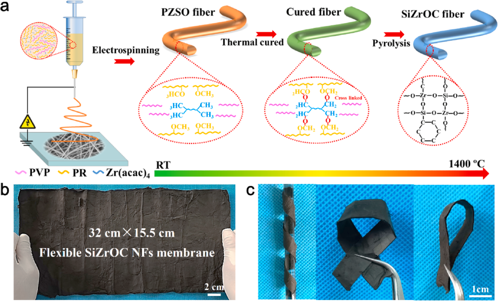

**Fig. 1.** Fabrication procedure and flexibility of the SiZrOC NFs. (a) Schematic of the fabrication processes using polymer electrospinning followed by pyrolysis to fabricate SiZrOC NFs; (b) Digital image of the large-scale SiZrOC NF membrane and (c) the SiZrOC NF membranes present high flexibility. 

3 

_Chemical Engineering Journal 410 (2021) 128304_ 

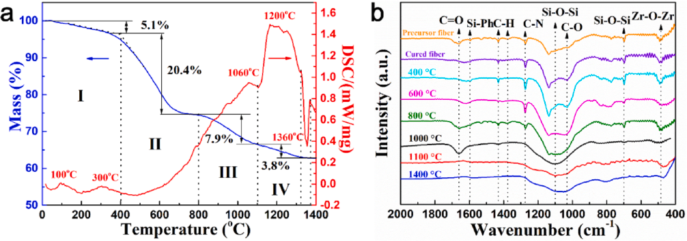

**Fig. 2.** (a) TG-DSC curves of the thermal cured NFs in Ar; (b) FTIR spectra of precursor NFs, cured NFs and cured NFs pyrolyzed at various temperature (from 400◦ C to 1400◦ C) in Ar. 

further mass loss of about 5.9% was recorded from 800◦ C to 1100◦ C (third stage), and the endothermic peak at 1060◦ C was attributed to the cleavage of C–– O and C–O bands, corresponding to the C–– O and C–O peaks disappeared of 1100◦ C sample (Fig. 2b). From 1100◦ C to 1400◦ C (fourth stage), a small mass loss of 3.8 wt% may be the decomposition residual hydrogen and oxygen in the fiber. It was worth noting that at the temperature above 1300◦ C, the weight was almost stable up to 1400◦ C. However, an exothermic peak (1360◦ C) was observed in this temperature range. At the temperature above 1300◦ C, two reactions were likely to occur, namely the carbothermal reduction between the SiO2 and free carbon (formula (2)) and the SiO2 reaction with ZrO2 to form thermal stable ZrSiO4 (thermodynamically stable up to 1600◦ C, formula (3)) [27,28]. 

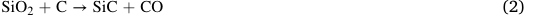

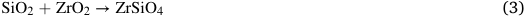

The carbothermal reduction is considered as disadvantageous as it consume the SiO2 phase with low solid thermal conductivity along with mass loss (CO release). However, the reaction of SiO2 with ZrO2 leads to form the thermal stable ZrSiO4 without weight loss. The stable weight from 1320◦ C to 1400◦ C, revealed that the reaction of SiO2 with ZrO2 was preferred, and most importantly, the ZrSiO4 formation suppressed the carbothermal reduction of SiO2 as the SiO2 was trapped by ZrSiO4. The formation of ZrSiO4 via the reaction between SiO2 and ZrO2 was further evidenced by the reaction energy. Fig. S2 shows Arrhenius plots of the apparent reaction rate of the SiZrOC NFs between the temperatures of 1330◦ C and 1380◦ C. The activation energy of the reaction for the SiZrOC NFs was calculated from the rate of weight loss to be − 23.9 kJ/mol, which was nearly the free enthalpy of formation for ZrSiO4 (− 24.0 kJ/mol) [27]. Considering the reaction enthalpy of the carbothermal reaction of silica forming SiC and CO, the reaction energy was 77.8 kJ/mol [27]. The ZrSiO4 formation in SiZrOC NFs at the temperature above 1300◦ C, as a consequence, led to strong suppression of the carbothermal reduction between SiO2 and carbon. Therefore, the SiZrOC NFs were stable up to 1400◦ C. The total weight loss was 37.2 wt% at the pyrolysis temperature up to 1400◦ C, corresponding to a ceramic yield of 62.8 wt%. 

SEM images of the SiZrOC NFs obtained from various precursor solutions and pyrolysis temperatures were shown in Fig. S3 and 3a-c. As shown in Fig. S3a, the average diameter of the SiZrOC NFs with PR content of 25 wt% pyrolyzed at 1000◦ C was 453.5 ± 67.3 nm, which could be due to the minimum viscosity of 80.5 mPa⋅s than the other precursor solutions (Fig. S4). In particular, when the PR content increased to 35 wt%, the SiZrOC NFs were tended to ribbon-shaped 

(Fig. S3b). Moreover, the diameter of the fibers was significantly increased from 1.48 ± 0.06 μm to 2.08 ± 0.19 μm with the PR content increased from 35 wt% to 55 wt% (Fig. S3c and d). The diameter increased could be contribute to the significantly increase in viscosity and decrease in conductivity of the corresponding precursor solution (Fig. S4). It has been found that ceramic fibers with smaller diameter, they exhibit better mechanical properties and thermal insulation performance [18,19]. Therefore, we chose the SiZrOC NFs with minimum diameter (453.5 ± 67.3 nm) for further investigated the effect of pyrolysis temperature on the microstructure and performances of the SiZrOC NFs. 

As the pyrolysis temperature increased from 1000◦ C to 1400◦ C, all the SiZrOC NFs exhibited smooth surfaces and uniform distribution with average diameter of 453.5 ± 67.3 nm, 449.5 ± 97.4 nm and 405.5 ± 78.7 nm, respectively (Fig. 2a-c and S5). The microstructure of the SiZrOC NFs pyrolyzed at 1400◦ C was further characterized by the TEM observation and the relevant EDS mapping results (Fig. 3d-f). As shown in Fig. 3e, the SiZrOC NFs mainly composed of Si, Zr, O and C elements. The content of Si, Zr, O and C was 34.72 wt%, 4.76 wt%, 39.05 wt% and 21.47 wt%, respectively. As shown in Fig. 3f, there were some nanoparticles wrapped in the amorphous matrix. HRTEM images (Fig. 3f) showed that the lattice spacing of the nanoparticles were about 0.297 nm and 0.328 nm, agreeing well with the (111) plane of t-ZrO2 and (200) plane of ZrSiO4, respectively, which indicated that the crystalline phases were t-ZrO2 and ZrSiO4. The results confirmed the formation of ZrSiO4, which agreed with the TG-DSC analysis [29,30]. 

The formation of SiZrOC ceramics was also evidenced from the XPS analysis. The pyrolyzed NFs were basically composed of Si, Zr, O and C elements (Figs. S6a). For further investigating the composition of the SiZrOC NFs pyrolyzed at 1400◦ C, the Si2p, O1s and C1s peaks were chosen for the chemical bonding analysis (Fig. S6b-d). As presented in Fig. S6b, the XPS spectra of Si2p for SiZrOC NFs were divided into two peaks. The peaks located at 103.6 eV and 104.1 eV were related to the SiO-C and Si-O-Si bonds, respectively [23,31]. The existed Si-O-C and SiO-Si bonds were attributed to the SiOxCy and SiO2 phases in the SiZrOC NFs, respectively. As shown in Fig. S6c, the core level of O1s peak were fitted into three peaks with typical binding energy of 531.3 eV, 532.9 eV and 533.3 eV, which respectively corresponded to ZrSiO4, Si-O and Si-OZr chemical bonds [32]. The results also confirmed the formation of ZrSiO4, corresponding to the TG-DSC and TEM analysis. The C1s spectrum showed a strong signal at 284.6 eV for aromatic carbon environment (C–C bond) compared with the distinguishable C–O peak at 286.4 eV (Fig. S6d), indicating the presence of free carbon in the SiZrOC NFs [23]. 

The formation of SiOxCy, SiO2 and free carbon phases within the 

4 

_Chemical Engineering Journal 410 (2021) 128304_ 

_X. Zhang et al.                                                                                                                                                                                                                                   Chemical Engineering Journal 410 (2021) 128304_ 

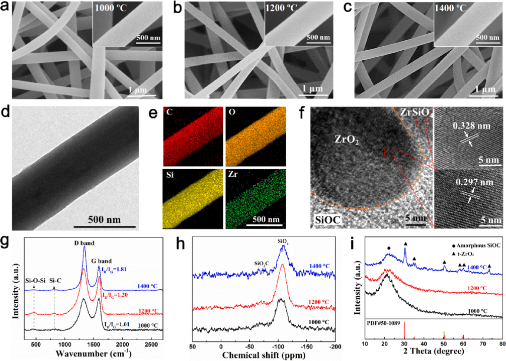

**Fig. 3.** SEM images of SiZrOC NFs pyrolysis at various temperatures: (a) 1000◦ C, (b) 1200◦ C and (c) 1400◦ C; (d) TEM image of a SiZrOC NF pyrolyzed at 1400◦ C; (e) TEM-EDS mapping of a single SiZrOC NF pyrolyzed at 1400◦ C with corresponding elemental mapping images of C, O, Si and Zr, respectively; (f) TEM and HRTEM images of SiZrOC NF pyrolyzed at 1400◦ C; (g) Raman, (h) 29Si MAS-NMR and (i) XRD spectrum of the SiZrOC NFs pyrolysis at various temperatures (1000◦ C, 1200◦ C and 1400◦ C). 

SiZrOC NFs was further certified by the Raman analysis (Fig. 3g). Two fundamental vibrations were observed at 1350 cm−1 and 1590 cm−1 , which corresponded to D band and G band of free carbon, respectively. The D band related to disordered structures, which corresponded to a graphitic lattice vibration mode of sp3-hybridized carbon, while the G band corresponded to the E2g vibration mode of sp2-hybridized carbon [26]. The intensity ratio of D band to G band ( _ID/IG_ ) represented the degree of graphitization in carbon structure. With the pyrolysis temperature increased from 1000◦ C to 1400◦ C, the _ID/IG_ values gradually increased from 1.01 to 1.81(Fig. 3g), which indicated that the free carbon was formed of sp3-hybridized carbon at high-temperatures, and the graphitization of free carbon was decreased. Thus, it is reasonable to infer that the graphitization of free carbon in SiZrOC NFs was inhibited by the crystalline ZrO2 nanoparticles at high-temperatures [26]. Moreover, two characteristic peaks at 464 cm−1 and 846 cm−1 corresponded to the typical Raman modes of the Si-O-Si and SiC were observed [31]. The existed Si-O-Si bond and SiC units were likely resulted from the SiO2 and SiOxCy phases in the SiZrOC NFs, respectively. Furthermore, the 29Si MAS NMR was used to identify the various Si sites in the SiZrOC NFs, as shown in Fig. 3h. The 29Si MAS-NMR spectrum presented two typical signal at − 71 ppm and − 106 ppm, which were attributed to the SiO3C and SiO4 units, respectively [26,33]. The results also confirmed the SiOxCy phase in the SiZrOC NFs. 

In order to investigate the microstructure of the SiZrOC NFs, the XRD patterns of the SiZrOC NFs pyrolysis at 1000–1400◦ C were collected, as shown in Fig. 3i. The spectra of the SiZrOC NFs pyrolysis at 1000◦ C and 1200◦ C showed an entirely amorphous structure only with a broad peak 

at 2θ = 22.5◦ , corresponding to the amorphous SiOxCy [26]. With increasing pyrolysis temperature up to 1400◦ C, except for the peak of amorphous SiOxCy, the pattern presented a series of well-defined diffraction peaks, and agreed well with the (011), (002), (112), (013), (121) and (004) planes of t-ZrO2 (JCPDS.NO.50–1089). The sharp diffraction peaks indicated that the formation of crystal ZrO2 in the SiZrOC NFs with pyrolysis temperature at 1400◦ C. However, the ZrSiO4 peaks could not be identified from the XRD patterns, which was likely due to the limitations of the XRD to detect the component with very low contents. 

Based on the above analysis, the SiZrOC NFs were composed of SiOxCy, SiO2, ZrO2, free carbon and ZrSiO4 phases. Such multiple phases in the SiZrOC NFs led to the decrease of the thermal conductivity of the SiZrOC NFs due to significant phonon-interface scattering by the abundant phase interfaces [20]. Moreover, the existence of the SiOxCy and free carbon phases had the potential to effectively absorb and diffuse infrared radiation, which in favor of decreasing radiation heat transfer at high-temperatures [16]. Therefore, the SiZrOC NFs were expected to have excellent thermal insulation performance, which will be discussed later. 

#### _3.2. Mechanical properties of SiZrOC NFs_ 

Mechanical properties of the thermal insulators are vital factors in their practical applications. For the electrospun ceramic NF membranes, the tensile strength and flexibility are two of the representative criteria when evaluating its mechanical properties. The tensile strength of the 

5 

_Chemical Engineering Journal 410 (2021) 128304_ 

_X. Zhang et al._ 

SiZrOC NF membranes were quantified by uniaxial tensile tests, typical stress–strain curves of samples were presented in Fig. 4a. 

As shown in Fig. 4a, the SiZrOC NF membranes pyrolyzed at 1200◦ C showed the maximum tensile strength of 0.812 ± 0.086 MPa, which was similar to the most reported high-strength ceramic NF membranes [6,25]. A piece of SiZrOC NF membrane (with a width of ~ 15 mm) pyrolyzed at 1200◦ C exhibited robust mechanical strength that could hang a 100 g weight without fracture (inset in Fig. 4a). 

To investigate the flexibility of SiZrOC NF membranes, the bending rigidity was calculated according to the bending stiffness test. As seen from Fig. 4b, the SiZrOC NF membranes pyrolyzed at 1000◦ C and 1200◦ C showed almost similar flexibility with flexural rigidity of 0.09 ± 0.003 mN⋅mm2 and 0.11 ± 0.01 mN⋅mm2 , respectively. The SiZrOC NF membranes obtained from 1200◦ C exhibited excellent flexibility that could maintain its original shape without fracture after various deformations including twining, bending and folding (Fig. 1 c). In addition, no breakage was observed on the SiZrOC NF membranes (with size of 9.8 cm × 4.5 cm) after 1000 times bending test (Fig. S7 and movie S1). Of note, the tensile strength (0.792 ± 0.101 MPa) of the SiZrOC NF membranes were well maintained after the bending test (Fig. S8). Furthermore, the SEM analysis was used to evaluate the flexibility and morphology of the bent SiZrOC NF membranes. As shown in Fig. 4d, there were no cracks in the bent SiZrOC NFs, suggesting excellent flexibility of the membranes. This excellent flexibility of the membrane can be explained by the slip and bending of the individual SiZrOC NF. 

Note that a single NF can tolerate extreme deformation (bending angle of 109◦ ) without any fracture in Fig. 4e, indicating the single NF was robust. The robust mechanical flexibility of the SiZrOC NFs was likely attributed to the microstructure of the NF was dense (Fig. 3d and f). The results were also evidenced by the true density of the SiZrOC NFs 

pyrolyzed at various temperatures. The true density of the SiZrOC NFs pyrolyzed at 1000◦ C, 1200◦ C and 1400◦ C were 1.95 g⋅cm−3 , 1.94 g⋅cm−3 and 1.91 g⋅cm−3 , respectively. It can be seen that the true density of the SiZrOC NFs was well reserved even under pyrolysis at 1400◦ C, which indicated that the SiZrOC NFs had dense microstructure at hightemperatures. 

Moreover, there were abundant nanoparticles within the NFs (Fig. 3 f), which likely inhibited the initiation and propagation of cracks during the bending process [25]. Such outstanding flexibility facilitated our SiZrOC NFs practical application in thermal insulation fields. With increasing pyrolysis temperature, the bending rigidity was slightly increased, which was likely due to grain growth at high-temperatures. Thus, the SiZrOC NFs pyrolyzed at 1200◦ C with high mechanical property were selected for the following investigation. 

#### _3.3. High-temperature stability of SiZrOC NFs_ 

We further investigated the high-temperature stability of the SiZrOC NFs. As shown in Fig. 5a, the thermal stability of SiZrOC NFs in Ar atmosphere was investigated by TG analysis from 25◦ C to 1400◦ C. The SiZrOC NFs were stable up to 1400◦ C with a weight loos _<_ 7.9%, which indicated that the SiZrOC NFs were stable at high-temperatures. In order to obtain more detailed information on the thermal stability of the SiZrOC NFs, the SiZrOC NF membranes were heat treated at various temperatures (1000◦ C, 1200◦ C and 1400◦ C) for 1 h in Ar atmosphere, then the tensile strength of the heat-treated SiZrOC NF membranes were measured and the tensile strength retentions were calculated, as shown in Fig. 5b. The SiZrOC NF membranes showed high tensile strength retentions (99.1% and 96.2%) after being heat-treated at 1000◦ C and 1200◦ C, respectively. The tensile strength retention was still up to 

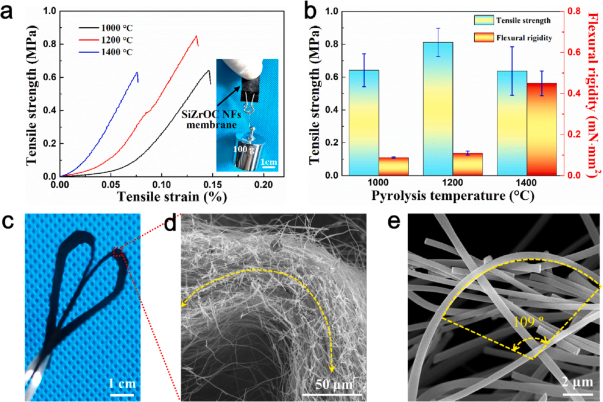

**Fig. 4.** (a) Stress-strain curves and (b) tensile strength and flexural rigidity of the SiZrOC NF membranes with various pyrolysis temperatures; (c) Digital image of the SiZrOC NF membrane with pyrolysis temperature at 1200◦ C; (d) SEM image of the bent SiZrOC NF membrane; (e) SEM image showing the bending angle of a single SiZrOC NF. 

6 

_Chemical Engineering Journal 410 (2021) 128304_ 

_X. Zhang et al.                                                                                                                                                                                                                                   Chemical Engineering Journal 410 (2021) 128304_ 

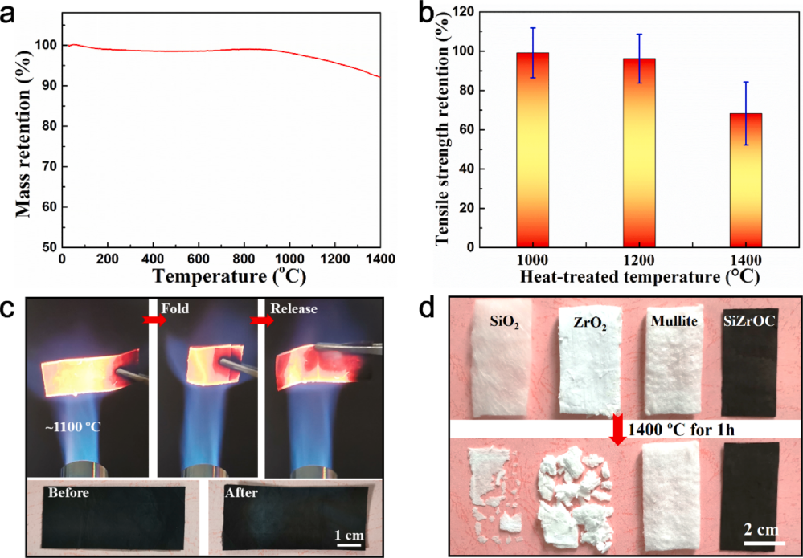

**Fig. 5.** (a) TG curve of the SiZrOC NFs in Ar atmosphere from 25 to 1400◦ C; (b) Tensile strength retention of the SiZrOC NF membranes heat-treated at various temperatures; (c) Bending test of the SiZrOC NFs in the flame of a butane blowtorch (Top); Digital images of the SiZrOC NF membrane before and after tested (Bottom); (d) High-temperature stability of SiZrOC NFs compared with those of common SiO2, ZrO2 and mullite fibers. 

68.3%, even after being heat-treated at 1400◦ C, obviously higher than the most of oxide ceramic fibers [6–8]. The results indicated that the mechanical properties of SiZrOC NFs membranes were well maintained after being heat-treated at high-temperatures, which correlated well with the high mass retention of the SiZrOC NFs up to 1400◦ C (Fig. 5a), and was a strong evidence that the as-prepared SiZrOC NFs in this study were promising for high-temperature application up to 1400◦ C. Moreover, the high-temperature thermal stability of the SiZrOC NFs were assessed by bending test in the butane blowtorch flame (~1100◦ C). As demonstrated in Fig. 5c (see also movie S2), the SiZrOC NF membranes were nonflammable and stable when they were exposed to the hightemperature flames. Besides, they still well preserved without any visible damage and exhibited good flexibility after several bending cycles upon flame burning, highlighting the high-temperature flexibility and thermal stability of the SiZrOC NF membranes. Such excellent flexibility and thermal stability makes our SiZrOC NFs an attractive candidate for high-temperature thermal insulating materials. 

Furthermore, we compared the high-temperature stability of our SiZrOC NFs with other commercial thermal insulating ceramic fibers, such as SiO2, ZrO2 and mullite, as shown in Fig. 5d. After being heat treated at 1400◦ C for 1 h, the SiZrOC NF and mullite fiber membranes maintain original morphology and flexibility (Fig. S9), while the SiO2 fiber was melt and the ZrO2 fiber was brittle (Fig. 5d). The results indicated that the SiZrOC NFs exhibited similar high-temperature thermal stability with the mullite fiber, obviously superior than the commonest SiO2 and ZrO2 fibers. The mechanisms of the excellent thermal stability of the SiZrOC NFs were as follows: (1) the solid-state reaction of ZrO2 with SiO2 form the ZrSiO4 (with thermally stable Zr-O-Si structure) at high-temperatures, which suppresses the carbothermal reaction 

between SiO2 and free carbon; (2) the free carbon within the fiber could slow the grain growth at high-temperatures [34]. The results evidenced by the TG-DSC, TEM and XPS analysis. Hence, we could rationally conclude that the prepared SiZrOC NFs exhibited excellent thermal stability. 

#### _3.4. Thermal insulation performance of SiZrOC NFs_ 

As expected, the SiZrOC NF membranes with high flexibility and thermal stability showed excellent thermal insulation performance. As shown in Fig. 6a, a piece of SiZrOC NF membrane with thickness of 10 mm protected fresh flower from wilting under the heating of alcohol lamp for 10 min, indicating that the membranes with excellent thermal insulation performance. Moreover, the infrared thermography suggested that the SiZrOC NF membranes had good thermal insulation performance (Fig. 6a, right). To further evaluate the high-temperature thermal insulation performance of the SiZrOC NF membranes, temperature distribution of the SiZrOC NF membranes in the front and back side was tested by infrared camera observation, in which the front side was directed fired by the flame of a ~ 1100◦ C butane spray gun, as shown in Fig. S10. The SiZrOC NF membrane (with thickness of 10 mm) exhibited promising thermal insulation against a high-temperature butane blowtorch flame, achieving a significantly low temperature of 43.2◦ C and 53.8◦ C at the back side for heating 30 s and 60 s, respectively (Fig. S10, bottom). These results indicated that the SiZrOC NF membranes could serve as a robust insulation materials with potential for high-temperature fields. 

As the mullite fiber is the thermal insulating fiber with highest working temperature (~1400◦ C) at present, the thermal conductivities 

7 

_Chemical Engineering Journal 410 (2021) 128304_ 

_X. Zhang et al._ 

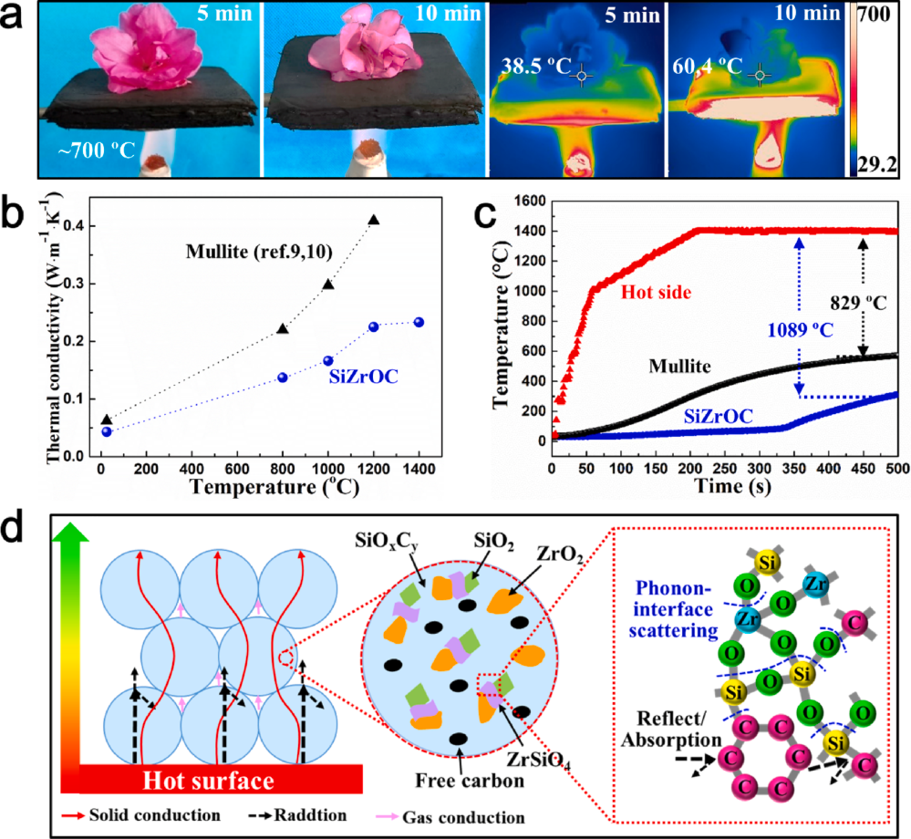

**Fig. 6.** (a) Fresh petal protected by the SiZrOC NF membrane with a thickness of 10 mm from wilting under the heating of an alcohol lamp for 10 min (left); Infrared thermography of SiZrOC NF membrane heating of an alcohol lamp for 5 min and 10 min (right); (b) Thermal conductivity of the SiZrOC NFs and reported mullite fibers membranes; (c) Temperature-time curves of the SiZrOC NFs and mullite membranes at high-temperatures (1400◦ C); (d) Schematic representation of the thermal insulation mechanism in SiZrOC NF membranes. 

of our SiZrOC NFs and the reported mullite fibers were compared. As shown in Fig. 6b, the thermal conductivities of the SiZrOC NF membranes at 25, 800, 1000, 1200 and 1400◦ C were 0.043, 0.137, 0.166, 0.225 and 0.233 W m−1 ⋅K−1 , respectively. Particularly, the thermal conductivity values were lower than the mullite fibers at various temperatures [9,10]. The results indicated that our SiZrOC NF membranes with much better thermal insulation performance than the mullite fibers. Further, we compared the thermal insulation performance of the SiZrOC NFs and mullite fibers with temperature–time curves. The SiZrOC NF and mullite fiber membranes with an area of 35 mm × 40 mm and thickness of 20 mm were heated by a quartz lamp, and then the temperatures of the heating plate and the membranes outer surface were simultaneously collected with thermocouples. The schematic diagram of the thermal insulation experimental device was shown in Fig. S11a, and photos of experimental sample and test site were shown in Fig. S11b and c, respectively. The absolute temperature difference ( _|ΔT|_ ) between the hot surface and the cold surface represented the thermal insulation performance, where a higher _|ΔT|_ means better thermal insulation 

performance. As illustrated in Fig. 6c, when the hot surface temperature rapidly increased to 1400◦ C in 200 s and hold for 300 s, the _|ΔT|_ values for SiZrOC NF membrane and mullite fiber membrane were 1089◦ C and 829◦ C, respectively, which indicated that the SiZrOC NF membranes showed much better thermal insulation performance than the commercial high-temperature thermal insulator-mullite fiber. 

Typically the total thermal conductivity ( _λtotal_ ) for SiZrOC NF membranes can be represented as the sum of contributions from three parts (formula 4), i.e., the conduction through the solid ( _λs_ ), the conduction through the gas ( _λg_ ) and the radiation heat transfer ( _λr_ ). The convection of the gas trapped in the pores between SiZrOC NFs was not considered here because the pore size is much smaller than 5 μm. Convection of air with a pressure of 1 atmosphere (at Gr ≥ 1000) requires the void diameter to be larger than 10 mm [35]. Therefore, gas convection in typical SiZrOC NF membranes with pore sizes of several micrometers or less was suppressed completely, making essentially no contribution to thermal conductivity. 

8 

_Chemical Engineering Journal 410 (2021) 128304_ 

_X. Zhang et al.                                                                                                                                                                                                                                   Chemical Engineering Journal 410 (2021) 128304_ 

_λtotal_ = _λs_ + _λg_ + _λr_ (4) 

The solid thermal conductivity can be written as follows [20]: 

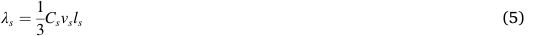

where _Cs_ is volumetric specific heat of the solid, _vs_ is the velocity of phonons in the solid, and _ls_ is the mean free path of phonons in the solid. Due to multi-phase (SiOxCy, SiO2, ZrO2, free carbon and ZrSiO4) in SiZrOC NFs, there were significant phonon-interface scattering when the phonon cross the interface between two phases [20]. Moreover, the SiOxCy phase is typical amorphous structure, the _ls_ is only a few lattice spacing due to the long-range disordered microstructure [21]. Therefore, according to formula (5), the multi-phase SiZrOC NFs have low _λs_ . In addition, there are a large number of joints between the NFs due to the small diameter of the SiZrOC NFs ( _<_ 500 nm), which hinder the heat transfer between NFs and contribute to decrease _λs_ . The gas thermal conductivity can be described as follows [35,36]: 

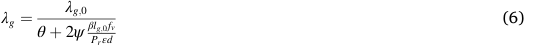

where _λg,0_ is the thermal conductivity of air, _θ_ , _ψ_ and _β_ are the parameters related to the Knudsen number, _Pr_ is the Prandtl number, _ε_ is the constant, _lg,0_ is the mean free path of a gas molecule, _fv_ is the volume fraction of fiber, _d_ is the diameter of fiber. The SiZrOC NFs own a small fiber diameter ( _<_ 500 nm), which results in low _λg_ according to formula 6. The radiative thermal conductivity can be expressed as follows [20,35]: 

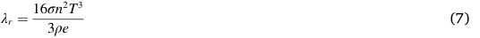

where _σ_ is the Stefen-Boltzmann constant, _n_ is the complex refractive index of the material, _T_ is the absolute temperature, _ρ_ is the apparent density of the sample, _e_ is the specific extinction coefficient. The contribution of radiative thermal conductivity to the total thermal conductivity is little at room temperature, while its contribution increases considerably at high-temperatures [16,20]. It should be noted 

that the SiOxCy and free carbon phases can greatly absorb and reflect infrared radiation, which results in high _e_ and the relatively low _λr_ [16]. Based on the discussion above, it is concluded that these three low thermal conductivity components together contribute to the low thermal conductivity of the SiZrOC NF membranes at high-temperatures. The thermal insulation mechanism of the SiZrOC NF membranes is schematically represented in Fig. 6d. 

For comparison, the SiZrOC NF membranes present a unique combination of low thermal conductivity, outstanding fire resistance, flexibility and thermal stability (up to 1400◦ C), which offer a far superior maximum working temperature and thermal insulation performance to that of most current thermal insulating materials, such as polymeric thermal insulators [37–39], oxide aerogels and its composites [40–43] and ceramic fibers or nanofiber aerogels [2,4–10,12,13,18,31,44,45] (Fig. 7). The as-prepared SiZrOC NFs show distinct advantage for thermal insulation applications exposed to extreme conditions, such as hightemperature thermal protection for space vehicles. 

#### **4. Conclusions** 

In summary, multi-phase SiZrOC NFs containing low thermal conductivity phases (ZrO2 and SiO2) and high thermal stability and infrared shielding phases (SiOxCy and C) based on the high-temperature thermal insulation mechanism were carefully designed. The SiZrOC NFs displayed unique combination of remarkable properties, including high flexibility, excellent thermal stability (up to 1400◦ C) and low thermal conductivity (~0.043 W m−1 K−1 at 25◦ C and ~0.233 W m−1 K−1 at 1400◦ C in Ar). The ultralow thermal conductivity is benefited from the reasonably designed multi-phase microstructure, which enhanced the phonon transfer barrier and effectively decreased the infrared radiation heat transfer. The excellent thermal stability is likely attributed to the formation of thermal stable Si-O-Zr structure. These outstanding properties make our SiZrOC NFs promising thermal insulating material in extreme conditions. Furthermore, the design concept and fundamental thermal insulation mechanisms of the multi-phase SiZrOC NFs are demonstrated. Thus, we can expect that, this strategy should be applicable to many other types of high-performance multi-phase thermal insulating materials. 

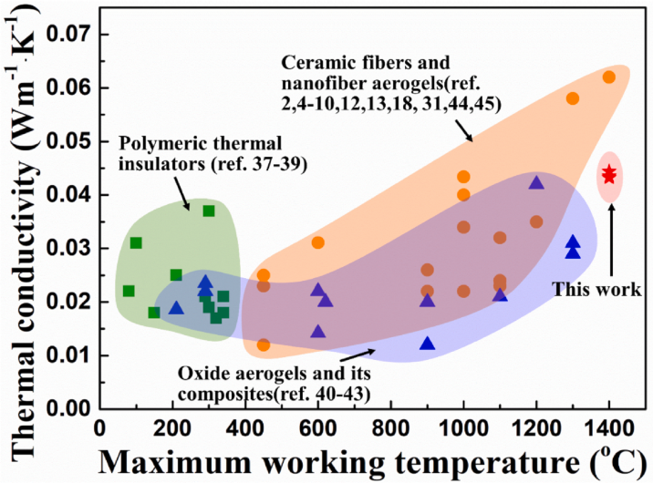

**Fig. 7.** Ambient _λ_ versus maximum working temperature for thermal insulation materials. 

9 

_Chemical Engineering Journal 410 (2021) 128304_ 

_X. Zhang et al.                                                                                                                                                                                                                                   Chemical Engineering Journal 410 (2021) 128304_ 

#### **Declaration of Competing Interest** 

The authors declare that they have no known competing financial interests or personal relationships that could have appeared to influence the work reported in this paper. 

#### **Acknowledgments** 

This work is supported by the Defense Industrial Technology Development Program (JCKY2017****) and Research Project of NUDT (ZK20-08). 

#### **Appendix A. Supplementary data** 

Supplementary data to this article can be found online at https://doi. org/10.1016/j.cej.2020.128304. 

#### **References** 

|[1] X. Xu, Q. Zhang, M. Hao, Y. Hu, Z. Lin, L. Peng, T. Wang, X. Ren, C. Wang, Z. Zhao,|
|---|
|C. Wan, H. Fei, L. Wang, J. Zhu, H. Sun, W. Chen, T. Du, B. Deng, G.J. Cheng,|
|I. Shakir, C. Dames, T.S. Fisher, X. Zhang, H. Li, Y.u. Huang, X. Duan, Double- negative-index ceramic aerogels for thermal superinsulation, Science 363 (2019) 723–727.|

|[2] L. Su, H. Wang, M. Niu, S. Dai, Z. Cai, B. Yang, H. Huyan, X. Pan, Anisotropic and hierarchical SiC@SiO 2 nanowire aerogel with exceptional stiffness and stability for thermal superinsulation, Sci. Adv. 6 (2020) eaay6689.|
|---|

- [3] H. Wang, M. Cao, H.B. Zhao, J.X. Liu, C.Z. Geng, Y.Z. Wang, Double-cross-linked aerogels towards ultrahigh mechanical properties and thermal insulation at extreme environment, Chem. Eng. J. 399 (2020), 125698. 

- [4] Y. Si, X. Wang, L. Dou, J. Yu, B. Ding, Ultralight and fire-resistant ceramic nanofibrous aerogels with temperature-invariant superelasticity, Sci. Adv. 4 (2018) eaas8925. 

- [5] L. Su, H. Wang, M. Niu, X. Fan, M. Ma, Z. Shi, S.-W. Guo, Ultralight, Recoverable, and High-Temperature-Resistant SiC Nanowire Aerogel, ACS Nano 12 (2018) 3103–3111. 

- [6] Y. Si, X. Mao, H. Zheng, J. Yu, B. Ding, Silica nanofibrous membranes with ultrasoftness and enhanced tensile strength for thermal insulation, RSC Adv. 5 (2015) 6027–6032. 

- [7] T. Wang, Z. Zhang, C. Dai, Q.i. Li, Y. Li, J. Kong, C. Wong, Amorphous silicon and silicates-stabilized ZrO2 hollow fiber with low thermal conductivity and high phase stability derived from a cogon template, Ceram. Int. 45 (2019) 7120–7126. 

- [8] P. Zhang, D. Chen, X. Jiao, Fabrication of Flexible α-Alumina Fibers Composed of Nanosheets, Eur. J. Inorg. Chem. 2012 (2012) 4167–4173. 

- [9] L. Xian, Y. Zhang, Y. Wu, X. Zhang, X. Dong, J. Liu, A. Guo, Microstructural evolution of mullite nanofibrous aerogels with different ice crystal growth inhibitors, Ceram. Int. 46 (2020) 1869–1875. 

- [10] G. Zu, J. Shen, W. Wang, L. Zou, Y.a. Lian, Z. Zhang, B. Liu, F. Zhang, Robust, Highly Thermally Stable, Core–Shell Nanostructured Metal Oxide Aerogels as High-Temperature Thermal Superinsulators, Adsorbents, and Catalysts, Chem. Mater. 26 (2014) 5761–5772. 

- [11] L. Xu, J. Huang, Metamaterials for Manipulating Thermal Radiation: Transparency, Cloak, and Expander, Phys. Rev. Appl. 12 (2019). 

- [12] L.A. Dombrovsky, Quartz-Fiber Thermal Insulation: Infrared Radiative Properties and Calculation of Radiative Conductive Heat Transfer, J. Heat Transfer 118 (1996) 408–414. 

- [13] Y.W. Lo, W.C.J. Wei, C.H. Hsueh, Low thermal conductivity of porous Al2O3 foams for SOFC insulation, Mater. Chem. Phys. 129 (2011) 326–330. 

- [14] X.G. Shi, M.Y. Li, W.G. Ma, X.G. Zhou, X. Zhang, Experimental Study on Thermal Transport Property of KD-II SiC Fiber, J. Inorg. Mater. 33 (2018) 756. 

- [15] X. Hou, Y.P. Chen, W. Dai, Z.W. Wang, H. Lia, C.T. Lina, K. Nishimura, N. Jiang, J. H. Yu, Highly thermal conductive polymer composites via constructing microphragmites communis structured carbon fibers, Chem. Eng. J. 375 (2019), 121921. 

- [16] J. Yang, H. Wu, G. Huang, Y. Liang, Y. Liao, Modeling and coupling effect evaluation of thermal conductivity of ternary opacifier/fiber/aerogel composites for super-thermal insulation, Mater. Des. 133 (2017) 224–236. 

- [17] P.W. Gibson, C. Lee, F. Ko, D. Reneker, Application of nanofiber technology to nonwoven thermal insulation, J. Eng. Fibers Fabr. 2 (2007) 32–40. 

- [18] B. Wang, Y.D. Wang, Effect of fiber diameter on thermal conductivity of the electrospun carbon nanofiber mats, Adv. Mater. Res. 332 (2011) 672–677. 

- [19] J.H. Yan, Y.H. Han, S.H. Xia, X. Wang, Y.Y. Zhang, J.Y. Yu, B. Ding, Polymer template synthesis of flexible BaTiO3 crystal nanofibers, Adv. Funct. Mater. 29 (2019), 1907919. 

- [20] S. Shin, Q.Y. Wang, J. Luo, R.K. Chen, Advanced Materials for High-Temperature Thermal Transport, Adv. Funct. Mater. 30 (2020), 1904815. 

- [21] W.X. Zhou, Y. Cheng, K.Q. Chen, G.F. Xie, T. Wang, G. Zhang, Thermal Conductivity of Amorphous Materials, Adv. Funct. Mater. 30 (2020), 1903829. 

- [22] H. Yamaoka, T. Ishikawa, K. Kumagawa, Excellent heat resistance of Si-Zr-C-O fibre, J. Mat. Sci. 34 (1999) 1333–1339. 

- [23] D. Su, X. Yan, N. Liu, X.L. Li, H.N. Ji, Preparation and characterization of continuous SiZrOC fibers by polyvinyl pyrrolidone-assisted sol–gel process, J. Mater. Sci. 51 (2016) 1418–1427. 

- [24] X.S. Zhang, B. Wang, N. Wu, C. Han, C.Z. Wu, Y.D. Wang, Flexible and thermalstable SiZrOC nanofiber membranes with low thermal conductivity at hightemperature, J. Eur. Ceram. Soc. 40 (2020) 1877–1885. 

- [25] N. Wu, B. Wang, Y.D. Wang, Enhanced mechanical properties of amorphous SiOC nanofibrous membrane through in situ embedding nanoparticles, J. Eur. Ceram. Soc. 101 (2018) 4763–4772. 

- [26] C. Liu, R.Q. Pan, C.Q. Hong, X.H. Zhang, W.B. Han, J.C. Han, S.Y. Du, Effects of Zr on the precursor architecture and high-temperature nanostructure evolution of SiOC polymer-derived ceramics, J. Eur. Ceram. Soc. 36 (2016) 395–402. 

- [27] E. Ionescu, B. Papendor, H.J. Kleebe, R. Riedel, Polymer derived silicon oxycarbide/hafnia ceramic nanocomposites. Part II: Stability toward decomposition and microstructure evolution at T≥1000◦ C, J. Am. Ceram. Soc. 93 (2010) 1783–1789. 

- [28] A. Kaiser, M. Lobert, R. Telle, Thermal stability of zircon (ZrSiO4), J. Eur. Ceram. Soc. 28 (2008) 2199–2211. 

- [29] H. Qin, W.M. Guo, J.X. Liu, H.N. Xiao, Size-controlled synthesis of spherical ZrO2 nanoparticles by reverse micelles-mediated sol-gel process, J. Eur. Ceram. Soc. 39 (2019) 3821–3829. 

- [30] S. Vasanthavel, M. Ezhilan, V. Ponnilavan, J.M.F. Ferreira, S. Kannan, Manganese induced ZrSiO4 crystallization from ZrO2SiO2 binary oxide system, Ceram. Int. 45 (2019) 11539–11548. 

- [31] Y.N. Liu, Y. Liu, W.C. Choi, S. Chae, J. Lee, B.S. Kim, M. Park, H.Y. Kim, Highly flexible, erosion resistant and nitrogen doped hollow SiC fibrous mats for high temperature thermal insulators, J. Mater. Chem. A 5 (2017) 2664–2672. 

- [32] M.J. Guittet, J.P. Crocombette, M. Gautier-Soyer, Bonding and XPS chemical shifts in ZrSiO4 versus SiO2 and ZrO2: Charge transfer and electrostatic effects, Phys. Rev. B 63 (2001), 125117. 

- [33] E. Ionescu, H.J. Kleebe, R. Riedel, Silicon-containing polymer-derived ceramic nanocomposites (PDC-NCs): Preparative approaches and properties, Chem. Soc. Rev. 41 (2012) 5032–5052. 

- [34] Q.B. Wen, Z.J. Yu, R. Riedel, The Fate and Role of in situ Formed Carbon in Polymer-Derived Ceramics, Prog. Mater Sci. 109 (2020), 100623. 

- [35] F. Hu, S. Wu, Y. Sun, Hollow structured materials for thermal insulation, Adv. Mater. 31 (2019), 1801001. 

- [36] K. Daryabeugi, G.R. Cunnington, J.R. Knutson, Combined Heat Transfer in HighPorosity High-Temperature Fibrous Insulation: Theory and Experimental Validation, J. Thermophys Heat Transfer 25 (4) (2011) 536–546. 

- [37] X. Zhang, X.Y. Zhao, T.T. Xue, F. Yang, W. Fan, T.X. Liu, Bidirectional anisotropic polyimide/bacterial cellulose aerogels by freezedrying for super-thermal insulation, Chem. Eng. J. 385 (2020), 123963. 

- [38] Z.W. Liu, J. Lyu, D. Fang, X.T. Zhang, Nanofibrous Kevlar Aerogel Threads for Thermal Insulation in Harsh Environments, ACS Nano 13 (5) (2019) 5703–5711. 

- [39] J.W. Wu, W.F. Sung, H.S. Chu, Thermal conductivity of polyurethane foams, Int. J. Heat Mass Transf. 42 (1999) 2211–2217. 

- [40] G.Q. Zu, J. Shen, L.P. Zou, W.Q. Wang, Y. Lian, Z.H. Zhang, A. Du, Nanoengineering Super Heat-Resistant, Strong Alumina Aerogels, Chem. Mater. 25 (2013) 4757–4764. 

- [41] Z. Li, L.L. Gong, X.D. Cheng, S. He, C.C. Li, H.P. Zhang, Flexible silica aerogel composites strengthened with aramid fibers and their thermal behavior, Mater. Des. 99 (2016) 349–355. 

- [42] H.X. Zheng, H.R. Shan, X.F. Wang, L.F. Liu, J.Y. Yu, B. Ding, Assembly of silica aerogels within silica nanofibers: Towards a super-insulating flexible hybrid aerogel membrane, RSC Adv. 5 (2015) 91813–91820. 

- [43] H. Maleki, L. Dur˜aes, A. Portugal, An overview on silica aerogels synthesis and different mechanical reinforcing strategies, J. Non-Cryst. Solids 385 (2014) 55–74. 

- [44] C.C. Xu, H.L. Wang, J.N. Song, X.P. Bai, Z.L. Liu, M.H. Fang, Y.S. Yuan, J.Y. Sheng, X.Y. Li, N. Wan, H. Wu, Ultralight and resilient Al 2 O 3 nanotube aerogels with low thermal conductivity, J. Am. Ceram. Soc. 101 (2018) 1677–1683. 

- [45] B. Li, X. Yuan, Y. Gao, Y. Wang, J.H. Liao, Z.Y. Rao, B.X. Mao, H.Q. Huang, A novel SiC nanowire aerogel consisted of ultra long SiC nanowires, Mater. Res. Express 6 (2019), 045030. 

10 

