Annu. Rev. Mater. Res. 2006. 36:333–68 doi: 10.1146/annurev.matsci.36.011205.123537 Copyright _⃝_ c 2006 by Annual Reviews. All rights reserved First published online as a Review in Advance on April 25, 2006 

# **NANOFIBROUS MATERIALS AND THEIR APPLICATIONS** 

### Christian Burger,1 Benjamin S. Hsiao,1_,_2 and Benjamin Chu1_,_2 

_1Department of Chemistry, Stony Brook University, Stony Brook, New York 11794-3400; email: cburger@sunysb.edu, bhsiao@notes.cc.sunysb.edu, bchu@notes.cc.sunysb.edu 2Stonybrook Technology and Applied Research (STAR), Chemistry Building, Stony Brook University, Stony Brook, New York 11794-3400_ 

**Key Words** electrospinning, electroblowing, nanofibers, nonwoven membranes, tissue engineering, ultrafiltration 

■ **Abstract** Nanostructuredfibrousmaterialshavebeenmademorereadilyavailable in large part owing to recent advances in electrospinning and related technologies, including the use of electrostatic or gas-blowing forces as well as a combination of both forces. The nonwoven structure has unique features, including interconnected pores and a very large surface-to-volume ratio, which enable such nanofibrous scaffolds to have many biomedical and industrial applications. The chemical composition of electrospun membranes can be adjusted through the use of different polymers, polymer blends, or nanocomposites made of organic or inorganic materials. In addition to the control of material composition, the processing flexibility in maneuvering physical parameters and structures, such as fiber diameter, mesh size, porosity, texture, and pattern formation, offers the capability to design electrospun scaffolds that can meet the demands of numerous practical applications. This review provides a selective description of the fabrication of nanofibrous membranes and applications with specific examples in anti-adhesion in surgery and ultrafiltration in water treatment. 

#### **1. INTRODUCTION** 

Engineeredmaterialsstructuredonacolloidallengthscale,inparticularnanoporous materials, can be created in a wide variety of ways, including self-assembly and templating, with or without calcination, and lithography, as well as via many other nanofabrication techniques (1). Electrospinning is one major way to directly engineer (without self-assembly, although self-assembly could be incorporated) nanostructures (in the form mainly of nonwoven fibers) with colloidal length scales (i.e., diameters mostly in the tens to hundreds of nm). For this reason, we emphasize electrospinning and associated procedures in this review. 

**333** 

1531-7331/06/0804-0333$20.00 

**334** BURGER■ HSIAO■ CHU 

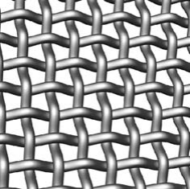

(a)  woven fabrics 

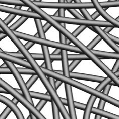

(b) nonwoven fabrics 

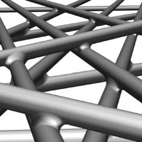

(c) “soldered” junctions 

**Figure 1** Artistic representations of woven and nonwoven fabrics. ( _a_ ) Woven fabrics with more regularly compartmentalized free space between the fibers. ( _b_ ) Nonwoven fabrics with interconnected continuous free space between the fibers. ( _c_ ) Nonwoven electrospun mat detail visualizing a soldering-like attachment of the nanofibers at their junction points through interpenetration and entanglement of polymer chains after annealing. 

When deposited as a nonwoven mat, the resulting fabrics are highly porous, i.e., they have a large interconnected void volume in the range of 50% to even greater than 90% and possess one of the highest surface-to-volume ratios among all cohesive porous materials. The entangled fibrous geometry has a pseudo-bicontinuous structure; the pore volume is essentially continuous and interconnected (Figure 1 _b_ ), whereas woven fabrics compartmentalize the pore volume more regularly (Figure 1 _a_ ). The mechanical stability of nonwoven structures, which depends on the chemical composition and processing procedure, can be improved further. For example, thecrossingpointsofthosefiberscanbeannealedandattachedtogether(Figure1 _c_ ). Electrospun nanofibrous materials have now gained rapid popularity in many applications. 

Electrospinning is an old technique. It was first observed by Rayleigh in 1897, studied in detail by Zeleny (2) in 1914 (on electrospraying), and patented by Formhals (3) in 1934. In particular, the work of Taylor and others on electrically driven jets has laid the groundwork for electrospinning (4). 

Electrospinning was viewed in its early days as an atomization process of a conducting fluid. When an external electrostatic field is applied to a conducting fluid (e.g., a charged semidilute polymer solution or a charged polymer melt), a suspended conical droplet, whereby the surface tension of the droplet is in equilibrium with the applied electric field, is formed. Electrostatic atomization occurs when the applied electrostatic field is strong enough to overcome the surface tension of the liquid. The liquid droplet at the tip of the spinneret then becomes unstable, and a tiny jet is ejected from the surface of the droplet. As it reaches a grounded target, the jet stream can be collected as an interconnected web of fine submicron-sized fibers. The resulting films from these nanoscaled fibers (nanofibers) have very large ratios of surface area to volume and very small pore sizes. 

NANOFIBROUS MATERIALS **335** 

The process, however, has not been used widely on an industrial scale, to our knowledge, except by the Donaldson Company, Inc. (Minneapolis), mainly for air filtration applications. The current drawback for other industrial productions of electrospun membranes continues to be the relatively low production rate. 

In this review, we aim to provide an overview of electrospinning technology, including its essential features, the primary controlling parameters, selected recent advances, and its limitations. After outlining the general applications, we emphasize specific developments that have already made substantial advances, e.g., in anti-adhesion and ultrafiltration, as examples of biomedical and industrial applications. Only pertinent references are cited, as hundreds of publications, including more than 60 recent patents and many reviews (5–13), have appeared in the literature. 

#### **1.1. Electrostatically Induced Jets** 

A typical electrospinning operation is as follows. An electrostatic potential (typically up to approximately 30 kV) is applied between a spinneret and a collector; both are electrically conducting and often separated at a distance of 10–15 cm between the two, as shown schematically in Figure 2. A fluid is slowly pumped 

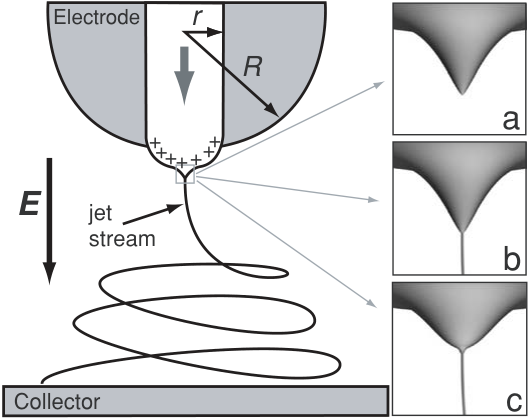

<!-- Start of picture text -->
Electrode r R a + +++ +++ E jet stream b Collector c <!-- End of picture text -->

**Figure 2** Schematic representation of an electrospinning apparatus ( _r_ , radius of the capillary; _R_ , curvature radius of the electrode used) and Taylor cones. ( _a_ ) Formation of Taylor cone in an applied electric field. ( _b_ ) Taylor cone ejects fluid jet. ( _c_ ) Surface tension causes cone shape to relax. Jet stream starts out in stable straight region, then becomes unstable, partly owing to charge repulsion, typically showing a whipping or spiralling motion. 

**336** BURGER■ HSIAO■ CHU 

through the spinneret. The fluid is usually a solution, whereby the solvent can evaporate during the spinning process while the jet stream travels from the conducting spinneret (held at high electric potential) to the collector (e.g., a rotating drum at ground potential, although the polarity between the spinneret and the collector could be reversed; i.e., the spinneret could be at ground, and the collector at high electric potential). The collector can be covered with a removable substrate for easier harvesting of the deposited mats. Electrospinning of polymer melts, especially polyethylene and polypropylene, is feasible in principle (14–17), but in practice it has several complications, especially with regard to the fast solidification process under a dynamic spinning condition at high temperatures. For the spinning of polymer melts, Fabbricante et al. [(18, 19); cf. also Section 2.6], have developed a high-throughput modular melt-blowing setup. They used a mechanical drawing force produced by narrow-streamed air jets to fabricate submicron-sized nonwoven fibers. However, the fiber diameters have remained larger and the uniformity poorer than those produced by means of electrospinning. 

The surface of the fluid droplet held by its own surface tension at the spinneret tip gets electrostatically charged. The interactions of the electrical charges in the polymer fluid with the external electric field cause the droplet to assume a conical shape, known as the Taylor cone (4, 20, 21), as shown in Figure 2 _a_ . The electrode shape and the spinneret (capillary) diameter are designed to yield a very high electric field strength with an appropriate field gradient at the tip of the cone so that a fluid jet stream can be pulled out; i.e., when the surface tension of the fluid can be overcome, the droplet becomes unstable, and a liquid jet is ejected (Figure 2 _b_ ). Subsequently, the surface tension causes the droplet shape to relax again, but the liquid jet continues to be ejected in a steady fashion (Figure 2 _c_ ). 

The travelling liquid jet stream is subject to a variety of forces with opposing effects (22). Electrostatic repulsion of the charges in the jet tends to increase its surface area. In the case of a cylindrical object like a fiber, this can be accomplished by reduction of the fiber diameter. Thus, the effect of electrostatic repulsion is similartothatofstretchingbymechanicaldrawinginconventionalfiberspinning.If the liquid is a solution and the solvent gradually evaporates, this effect is enhanced. Note that solvent evaporation changes the concentration and thus the viscosity of the liquid jet. 

On the other hand, as in any liquid, the surface tension tends to reduce the total surface of the jet, but not by keeping the fiber diameter large. Rather, what usually occurs is an instability that causes the jet to break up into droplets, each with a surface-minimizing spherical shape. This effect is known as Rayleigh instability (23). 

Which of these two opposing effects prevails depends on the nature and the mechanical properties of the fluid, especially its viscosity and surface tension. If the viscosity is sufficiently high and the fluid contains long-chain molecules, the 

NANOFIBROUS MATERIALS **337** 

fluid jet stream diameter will continuously shrink to very small values until the essentially dried filament is eventually deposited onto the collector, and at the same time, the solvent is evaporated along the jet stream pathway. This is the situation desired for electrospinning. 

Low-viscosity liquids cannot pose much resistance against the Rayleigh instability and tend to break up into droplets. If there are no chain molecules or they are not long enough to prevent a complete break up, discrete spherical droplets are formed. These charged droplets repel each other electrostatically and are, thus, prevented from coalescing. If there is a solvent involved, it continues to evaporate after the break up into droplets. The increasing charge density on the surface of the shrinking droplets can cause them to explode into even smaller droplets. This is the situation desired for electrospraying. 

Recently, Long and coworkers have demonstrated that high molecular weights are not essential for the electrospinning process if sufficient intermolecular interactions can provide a substitute for the interchain connectivity obtained through chain entanglements (24). Using this principle, these researchers were able to electrospin oligomer-sized phospholipids from lecithin solutions into nonwoven membranes. 

If the conditions of the sample are such that a Rayleigh instability occurs for long-chain molecules that cannot be easily broken up into discrete droplets, e.g., when the polymer concentration is above the overlap concentration, a “pearls-ona-string” morphology, also known as “beading,” can be formed. The occurrence of beading depends on the processing variables (25), especially the viscosity and the surface tension and, thus, on the concentration of the polymer solution, as shown for the example of electrospun poly(D,L-lactic acid) (PDLA) in Figure 3 (26). Note that charge density can be fine-tuned by, for example, salt addition. 

The strong repulsion due to high surface charges may, in principle, also be utilizedtoinitiateabifurcationprocessinwhichthejetstream(filament)isspatially separated into subfibers (“splaying”), but as is discussed in Section 2.1, this is normally not the case. 

#### **1.2. Electrospraying** 

Electrospraying, as first described in 1914 by Zeleny (2), can be used for the generation of very fine aerosols and has found industrial use in the application of paints and coatings to achieve very smooth surfaces. 

An interesting modification of the electrospraying process is based on coaxial jets of two immiscible fluids in which the break up results in micrometer-sized spherical droplets with a core-shell morphology, providing a kind of microencapsulation that may be useful for drug-delivery applications (27). Coaxial jets for the electrospinning of core-shell or hollow nanofibers are discussed in Section 2.4. Microencapsulation to form functionalized nanofibers is likewise within reach by electrospinning. 

**338** BURGER■ HSIAO■ CHU 

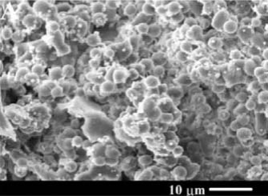

(a) 20 wt% 

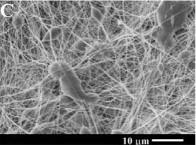

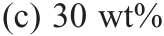

<!-- Start of picture text -->
(c) 30 wt% <!-- End of picture text -->

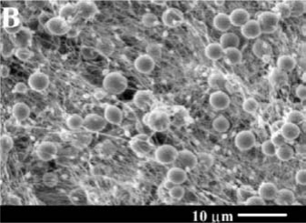

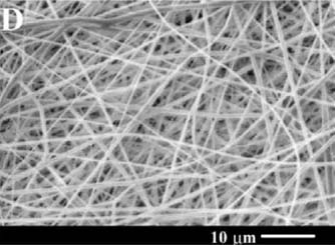

## (b) 25 wt% 

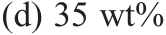

<!-- Start of picture text -->
(d) 35 wt% <!-- End of picture text -->

**Figure 3** Concentration effect on microstructures of electrospun poly(D,L-lactic acid) (PDLA) nanofibers at voltage of 20 kV, feeding rate of 20 _μ_ l min−1 , and concentrations of ( _a_ ) 20 wt%, ( _b_ ) 25 wt%, ( _c_ ) 30 wt%, and ( _d_ ) 35 wt%, respectively. Reproduced with permission from Reference 26. 

#### **1.3. Electrospray Ionization** 

Electrospraying found a very important application as a soft ionization technique for mass spectrometry, known as electrospray ionization (28). In traditional ionization techniques for mass spectrometry like electron impact ionization, the ionization is usually connected with a fragmentation of the molecules, especially if the molecules are large. Soft ionization techniques, on the other hand, leave the whole molecule intact, allowing mass spectrometric analysis also of macromolecules, especially proteins. 

The discovery of soft ionization techniques for mass spectroscopy and the subsequent application to obtain mass spectra of biomacromolecules were considered important enough that Fenn (29) was awarded part of the Nobel Prize for chemistry 

NANOFIBROUS MATERIALS **339** 

in 2002 for electrospray ionization; the Prize was shared with Tanaka (30) for soft ionization by laser desorption. 

#### **2. FUNDAMENTALS OF ELECTROSPINNING** 

The charged liquid jet, consisting of sufficiently long-chain molecules and without break up due to the Rayleigh instability, can elongate into a single fiber of considerable length with an extremely small diameter. Electrospun nanofibers down to diameters of a few nanometers have been observed (Figure 4). The mass of such a long but very thin nanofiber is very low. For example, if we take the distance between the Earth and the Moon to be _L_ = 380,000 km, it takes only _x_ grams of a polymer fiber filament of the polymer density _ρ_ = 1 g cm−3 and fiber diameter _d_ = 2 _r_ = 100 nm, where _x_ = _Vρ_ = _π r_2 _Lρ_ = _π_ (50 nm)2 (380,000 km) (1 g cm−3 ) ≈ 3 g. As is discussed in Section 2.5, it is a challenging task of current interest to generate large mass quantities using the electrospinning process without bifurcating the jet stream. 

The small fiber diameter is also responsible for the high specific ratio of surface area to volume that is important for many biomedical and industrial applications. A high degree of molecular alignment caused by the very large effective spin draw ratio (SDR) (literally reaching the range of in the millions) results in unique 

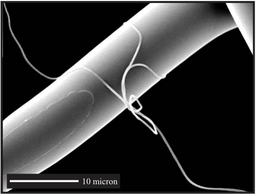

<!-- Start of picture text -->
10 micron <!-- End of picture text -->

**Figure 4** Size comparison of electrospun and conventionally spun polypropylene fibers, both spun from identical material (reproduced with permission from Reference 17). The diameter of the electrospun fiber is approximately 300 nm. In comparison, the diameter of a human hair is usually approximately 18–180 _μ_ m. 

**340** BURGER■ HSIAO■ CHU 

mechanical properties of the nanofibers that are mesoscopically anisotropic but have relatively low crystallinity. 

The filament diameter and its morphology (see Section 2.4) can be controlled by various parameters, such as applied electric field strength; spinneret diameter; distance between the spinneret and the collecting substrate; temperature; feeding rate; humidity; air speed; and properties of the solution or melt, including the type of polymer, polymer molecular weight, surface tension, conductivity, and viscosity. Furthermore, many of the solution properties, such as surface tension, conductivity, and viscosity, depend not only on temperature but also concentration (6), as summarized schematically in Figure 5. 

Instead of stating the variables, many of which are dependent, we may roughly group them into materials and processing parameters. The materials variables in solution electrospinning may be subdivided further into two groups. The first group is related to the nature of the components used, including chemical composition of the polymer(s) and solvent(s), and for polymer(s), the corresponding molecular weight (MW) and molecular weight distribution (MWD). The second group mainly includes properties of the solution, such as surface tension, viscosity, charge density, and solution conductivity. Many of these properties depend on solution 

||**Materials** **variables**||
|---|---|---|
|**Chemical** Composition composition|**Polymer** **MW**|**Polymer MWD**|
|Solution V**iscosity** **(T)** Solution v|**Surface** Tension (T) tension (T)|**Solvent**Quality **(T)** quality|
|Solution C**oncentration** Solution c|**Charge**Density density|**Solution** conductivity|
||**Processing** **variables**||
|**Electrode** Shape shape|**Electrode** M**aterials** m|**Electric**Field Strength field strength|
|Electrode- ground distance|Rate (T,P) Solution evaporation rate (T,P)|Solution Flow Solution flow rate|

**Figure 5** Variables in electrospinning. _T_ and _P_ denote temperature and pressure, respectively. 

NANOFIBROUS MATERIALS **341** 

concentration, solvent quality, and additives, as well as the temperature-dependent behavior of many of these parameters. At the same time, jet formation depends on the electrode design and electric field strength at the tip of the spinneret, whereas fiber formation from the jet stream also depends on the fluid input and the solution evaporation rate. 

The requirements for the viscoelastic properties of the fluid forming the liquid jet are quite stringent for successful electrospinning and usually only fulfilled by solutions of polymers. However, in special cases it is possible to generate suitably viscoelastic fluids by sol-gel chemistry from sol precursors, especially inorganic ones, so that electrospun nanofibers consisting of silica or aluminum oxide are possible (31, 32). 

The properties of electrospun nonwoven membranes can also be modified by annealing and/or stretching after the electrospinning process, which can improve their mechanical properties or/and degradation behavior, as shown in the case of electrospun poly(glycolide- _co_ -lactide) (33) and illustrated schematically in Figure 1 _c_ for annealing. A modification of the electrospinning setup involving a waterbath allows one to draw from the nonwoven web into a continuous uniaxial yarn (34). The last scheme represents a specialized demonstration with a narrowly focused objective and is suitable only for laboratory-scale production of electrospun yarns at this time. 

#### **2.1. Splaying Versus Whipping** 

After traveling linearly for a certain fraction of its path, continuously evaporating solvent, and thinning its diameter by stretching, the ejected liquid stream usually experiences instability in the jet propagation. To the naked eye (and from the perspective of low-speed photography), this instability appears to be splaying, e.g., in the form of repeated bifurcations, of the initially single-jet stream (with each jet stream leading toward a single filament) into multiple jet streams (or subfilaments), giving the impression of a frayed rope, as seen in Figure 6 _a_ . A reasonable explanation for the apparent splaying of the jet stream could be easily found in the increasing electrostatic repulsion of the different parts of the fiber surface (5). However, subsequent experimental evidence gathered with highspeed cameras (Figure 6 _b_ ) and theoretical models suggested that the apparent splaying was an optical illusion in the form of a very fast whipping motion of the jet. 

Based on the Coulomb interactions of their viscoelastic connected dumbbell model, Reneker and coworkers (35, 36) explained the observed whipping motion by a bending instability. The bending instability often causes the whipping jet to assume a spiralling loop conformation, visible in Figure 6 _b_ and sketched in Figure 2. Rutledge and coworkers (37–41) developed a theoretical model of the electrospinning process that tried to take into account the various possible axisymmetric and nonaxisymmetric instabilities. An axisymmetric instability may be a peristaltic undulation of the fluid stream, while bending and spiralling are nonaxisymmetric 

**342** BURGER■ HSIAO■ CHU 

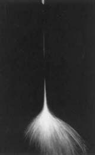

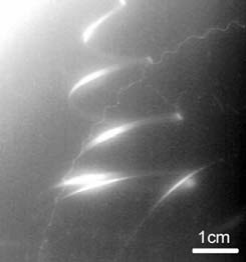

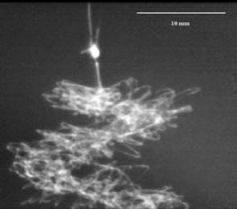

(a) Apparent (b) Spiralling whipping (c) Whipping,  “garland” formation splaying 

**Figure 6** Splaying versus whipping: electrified jet streams of poly(ethylene oxide) (PEO) in water, showing ( _a_ ) apparent splaying (low-speed photography) and ( _b_ ) a spiralling whipping motion of a single unbranched filament (high-speed photography); ( _c_ ) garland formation (50) of polycaprolactone (PCL) in acetone by contact merging of loops during the spinning. Figure 6 _a_ reproduced with permission from Reference 37. Figure 6 _b_ reproduced with permission from Reference 97. Figure 6 _c_ reproduced with permission from Reference 50. 

instabilities. They found a suppression of the axisymmetric Rayleigh instability while the nonaxisymmetric whipping instability is enhanced (37–41). 

#### **2.2. Specific Polymers Electrospun into Nanofibers** 

More than 100 different polymers, both synthetic and natural, have been successfully electrospun into nanofibers, mostly from polymer solution. It is important to note that electrospinning is a physical process. Therefore, in polymer solution electrospinning, all polymers may be electrospun into nanofibers, provided that the polymer MW is sufficiently high and the solvent can be evaporated in time during the jet transit time period over a distance between the spinneret and the collector. To control and to promote solvent evaporation, additional gas flow at elevated temperature can be introduced. This causes reductions in solution viscosity as well as surface tension (see Section 2.6), leading to an expansion of the range of polymer solutions that can be electrospun. 

Standard polymers successfully electrospun into nanofibers include polyacrylonitrile (PAN) (42), poly(ethylene oxide) (PEO) (22), poly(ethylene terephthalate) (PET) (5, 43), polystyrene (PS) (44), poly(vinyl chloride) (PVC) (45), Nylon-6 (46), poly(vinyl alcohol) (PVA) (47–49), poly( _ϵ_ -caprolactone) (PCL) (50, 51), Kevlar [poly( _p_ -phenylene terephthalamide), or PPTA] (52), poly(vinylidene fluoride) (PVDF) (53), polybenzimidazole (PBI) (54), polyurethanes (PUs) (55, 56), polycarbonates (57, 58), polysulfones (59), poly(vinyl phenol) (PVP) (60), and many others. For a discussion of electrospun biocompatible polymers, see 

NANOFIBROUS MATERIALS **343** 

Sections3.3–3.5.Itisalsopossibletoelectrospinblockcopolymersintonanofibers, as shown for the example of styrene-butadiene-styrene triblock copolymers (61). 

PAN nanofibers are of particular interest because of the PAN precursor status for carbon fibers; carbonization of PAN nanofibers leads to carbon nanofibers (62, 63). The latter carbon nanofibers distinguish themselves from catalytically grown carbon nanofibers by their much greater length. The electrospinning of a PAN composite nanofiber filled with multiwall carbon nanotubes (MWCNTs) may lead to a preferred orientation of the MWCNTs that is higher than that of the aligned surrounding PAN matrix (64). At sufficiently high MWCNT content, these composite fibers showed good electrical conductivity (64). The MWCNT content may also improve the properties of the resulting carbonized nanofiber owing to improved shrinkage behavior during carbonization (65). Electrospun polyimide nanofibers have also been successfully carbonized into carbon nanofibers (66). Another way to produce electrically conducting nanofibers is the electrospinning of electrically conducting polymers like doped polyaniline (63, 67), with promising applications in nanotechnology. 

Electrospinning has been used to produce nanofibers from natural biomacromolecules, including cellulose [either electrospun from cellulose acetate with subsequent hydrolysis (68) or directly electrospun from cellulose solutions in N,N-dimethylacetamide with lithium chloride (69)], collagen and gelatin (70–73), modified chitin (74), chitosan (75–77), and DNA (78). 

#### **2.3. Nanofiber Properties** 

The properties of typical electrospun polymeric nanofibers result from the strong shear forces to which they are subjected during the rapid electrospinning process and from the small fiber diameter. The large SDR exerted by the electrostatic fiber stretching process usually results in a very good molecular alignment, as evidenced in the very high degree of preferred orientation in wide-angle X-ray diffraction (WAXD) measurements for the example of electrospun poly(L-lactic acid) (PLLA) nanofibers (26). However, the degree of crystallinity may be relatively low in view of the very small fiber diameter as well as the very short transit time available for crystal formation. Nevertheless, one would expect that the good molecular alignment (envisioned as an oriented mesophase) may also lead to a higher tensile strength as compared to the macrofiber case, but there have been reports that this is not the case (79, 80), presumably owing to imperfections and pores in the nanofibers. 

Differential-thermal measurements (DSC) as well as WAXD indicated that the crystallinity of PLLA nanofibers was poor compared to that of bulk PLLA (26), most likely owing to the fast evaporation and solidification process during electrospinning, as briefly discussed above. DSC also showed a shift in the glass transition temperature of PLLA nanofibers to lower values when compared with that of bulk PLLA, possibly as a consequence of the very large specific surface of the nanofibers, the inclusion of plastisizers including air itself, and/or an increase in 

**344** BURGER■ HSIAO■ CHU 

the segmental mobility of those polymer chains close to the surface. The surface of nanofibers is often structured with pores, further increasing the already high surface-to-volume ratio (81, 82). 

#### **2.4. Nontrivial Nanofiber Shapes, Cross Sections, and Alignments** 

An interplay of charge density, surface tension, and viscoelasticity can cause beading (“pearls on a string”), leading to beaded nanofibers (26, 44, 83, 84), as discussed in Section 1.1. 

Under certain circumstances, electrospun nanofibers can assume the shape of flat ribbons (85). Note that the spinneret orifice was still circular in these cases. Rather, the flat ribbon shape was attributed to the collapse of an outer skin formed on the surface of the jet. Ribbons were also observed in electrospinning of Nylon6-clay composites (46), polycarbonates (57), and PVA (49). 

In electrospraying, a coaxial modification of the spinneret to allow the simultaneous treatment of two different liquids may lead, after break up, to droplets with a spherical core-shell morphology (27). For electrospinning, in which, in essence, no break up occurs, the coaxial nature of the ejected jet is preserved, and coaxial nanofibers having a cylindrical core-shell morphology can be created (86). At present it is not yet clear if, in view of the high speed of the electrospinning process, the requirement of immiscibility of the two coaxially present fluids may be relaxed to some extent if their interdiffusion is slow enough. The coaxial electrospinning procedure can still be useful even if the core component is not electrospinnable by itself but can be held together by the connected outer sheath of the spinnable polymer. 

Removal of the core from such a coaxial nanofiber, e.g., by dissolution with a selective solvent, leads to hollow nanofibers. Li and Xia (87) used this technique to prepare hollow nanofibers with walls consisting of a PVP/TiO2 composite, as shown in Figure 7. Subsequent removal of the remaining organic compounds led to ceramic hollow nanofibers. More elaborate functionalizations of the inner and outer surfaces of the hollow nanofibers are within reach (88, 89). 

If the collector in the electrospinning process is a homogeneous plate or drum, the deposited nanofibers typically assume a completely isotropic orientation in the two-dimensional plane. A straightforward way to introduce uniaxial alignment into the nanofiber deposit is to increase the rotation speed of a drum collector, but owing to the extremely high speed of the whipping motion caused by the bending instability (Section 2.1), the achievable degrees of preferred orientation obtainable by this method are limited (see also discussions in Section 2.5). 

However, deviations from the homogeneous collector shape can lead to high degrees of alignment. As Xia and coworkers (90, 91) showed, a linear gap of adjustable width from hundreds of micrometers to several centimeters in the collector, either just a void or made of an insulating material, may lead to a uniaxial alignment of the deposited nanofibers spanning over the gap. In the case of an air 

NANOFIBROUS MATERIALS **345** 

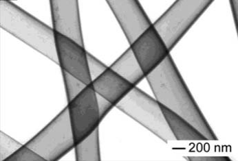

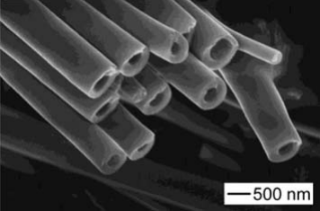

**Figure 7** Hollow nanofibers with walls core consisting of a PVP/TiO2 composite. The center core consisting of mineral oil was removed by extraction with octane. Reproduced with permission from Reference 87. 

gap without insulating material between the electrodes, the aligned nanofiber mat was freely suspended and transferrable to other substrates. 

Using geometric configurations consisting of multiple paired electrodes and sequentially activating pairs of them to guide the nanofiber alignment, one can generate quadratically aligned (or more complicated) nanofiber fabrics (91, 92). Instead of plane gaps, it is also possible to use two equidistant collector rings (93), accumulating aligned nanofibers within their air gap. One or both of the collector rings can be rotated. 

#### **2.5. Multijet Electrospinning** 

At first sight, the electrospinning process looks similar to conventional fiber spinning from polymer solution or melt; the major difference is that the important stretching of the fiber (characterized by the SDR) is not accomplished by mechanical drawing, as in traditional fiber productions, but by an applied electric field. Thus, one might assume that it should be possible to produce electrospun nanofibrous materials on a comparable industrial scale like that of conventionally spun polymer fibers, amounting to millions of tons per annum. However, it quickly becomes clear that this is not the case and that a laboratory-scale electrospinning setup cannot be easily scaled up to industrial throughputs. 

Conventionally spun polymer fibers typically have diameters of a few tens of micrometers, whereas electrospun nanofibers, which have diameters of a few tens to hundreds of nanometers, are two to three orders of magnitude thinner. Because the volume and thus the mass of a cylindrical shape depend on the square of the object’s diameter, to produce the same amount by weight of traditionally spun and electrospun fibers, the electrospun fiber needs to be longer by four to six orders of magnitude. A corresponding increase in speed of the electrospinning process is not feasible. 

This fact can be illustrated by a simple estimate, as one always intends to seek increases in the production rate with the least number of spinnerets. If we take a 

**346** BURGER■ HSIAO■ CHU 

10 wt% polymer solution, deliver it through a spinneret at a feeding rate of 2 ml h−1 , collect the nanofibers as a nonwoven mat with a fiber diameter of 500 nm (which is fairly large by electrospun fiber diameter standards), and assume a polymer density of 1 g cm−3 , the jet stream velocity _v_ , in the absence of bifurcation, is _v_ ≈ 0.2/(20 × 10−10 ) cm h−1 = 1000 km h−1 (or ∼600 mi h−1 ), i.e., on the order of the speed of sound. Under normal operating conditions, it is unlikely that one can exceed this fiber-spinning velocity by a large margin. Yet, with this production rate, the net fiber formation rate is 0.2 g h−1 . So, even if we were to operate the process 24 hours per day, each spinneret would produce fewer than 5 grams of fibers per day. Taking into account that the smaller the fiber diameter, the slower the production rate, it therefore would be wishful thinking to believe that, in the absence of bifurcation, industrial-scale productions could be achieved via the electrospinning process with few spinnerets. Bifurcation (splitting the jet stream) is an alternative approach. However, quality control and small fiber diameters as well as fiber diameter distributions become difficult issues to resolve. At present, electrospinning is most suitable for high value–added products that do not demand large-scale productions, such as applications in the biomedical and ultrafiltration fields. 

A possible solution presents itself in the form of multijet electrospinning, in which linear arrays of spinnerets simultaneously generate many nanofibers that are deposited together on the collector (13, 94–97). However, the array of spinnerets requires careful design, or electrostatic interferences between the charged spinnerets impede a successful spinning process. Furthermore, to produce homogeneous fabrics, all ejected jets and forming nanofibers need to be very closely synchronized in their spinning process evolution. The addition of ring-shaped secondary electrodes around the primary spinneret electrodes and/or of pressurized gas flow (see Section 2.6) can help to overcome these difficulties, but very careful designs are required so that the electric field distribution and/or the pressurized gas flow can remain essentially the same for each spinneret. The addition of secondary electrodes and/or pressurized gas flow further limits the achievable spinneret density. 

A prototype multiple-jet electrospinning apparatus, shown in Figure 8, has been developed. The design of multijet electrode arrays was guided by a twodimensional finite element analysis (FEA) for electromagnetics, through the use of software by Field Precision (http://www.fieldp.com). Extensive simulations for a single-jet system involving various parameters were carried out. Parameters included size, shape, and potential of the electrode; distance between the electrode tip and the ground; and the shape and the materials surrounding the electrode. The parameters obtained from the study of the single jet were used as the basis for the design of the multijet system (95). 

Figure 9 shows photographs of fluid distribution (Figure 9 _a_ ) and linear array eight-electrode assembly (9 _b_ ) of the prototype equipment constructed. The polymer solution was distributed by multiple syringes via a programmable motor to 

NANOFIBROUS MATERIALS **347** 

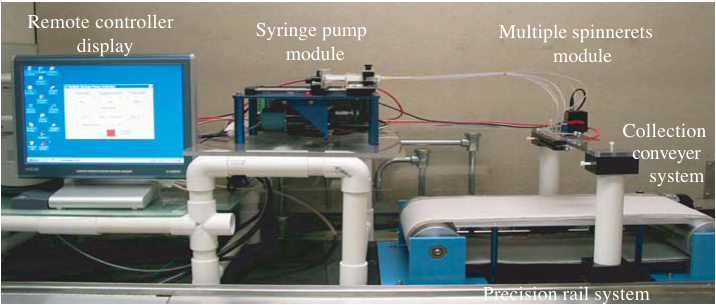

<!-- Start of picture text -->
Remote controller Syringe pump Multiple spinnerets display module module Collection conveyer system Precision rail system <!-- End of picture text -->

**Figure 8** Prototype multiple-jet electron-spinning apparatus (95). 

maintain the minimum pressure drop. Although each syringe can be controlled independently, allowing simultaneous processing of multiple polymer solutions, this configuration can be further improved to sustain the operation of multiplejet electrospinning. Long-term operation, including ease of cleaning the multiple spinnerets, is essential in an industrial production environment. 

In the prototype unit, the array spinneret system is mounted on two electrically insulated posts that are seated on a pair of precision rails (Figure 9). This configuration allows the array system to move along the “belt” direction back and forth. The precision rails can also be mounted on a “rocking” system so that the array can move in the direction perpendicular to the “belt” direction to enhance the uniformity of electrospun/blown membranes via computer control of translational motions in two directions. 

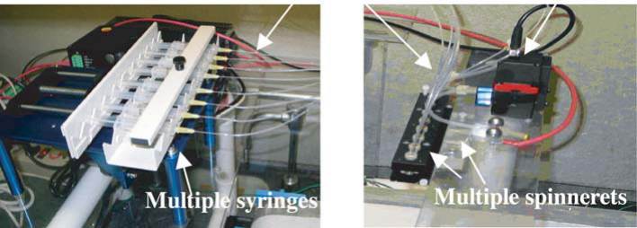

**Figure 9** ( _Left_ ) Fluid distribution and ( _right_ ) linear array jet assembly (95). 

**348** BURGER■ HSIAO■ CHU 

#### **2.6. Blowing-Assisted Electrospinning** 

As discussed in Section 2.2, more than 100 different polymers have been successfully spun into nanofibers. However, there is also a large number of polymers that could not be electrospun successfully. In those cases in which an extremely high viscosity of the polymer solution prevents successful electrospinning and this viscosity decreases with increasing temperature, as is normally the case, electrospinning in the presence of a hot air stream can be the solution. This technique, also known as blowing-assisted electrospinning or electroblowing (these terms are often used as synonyms, but we distinguish between them later in this Section), has been used to successfully electrospin hyaluronic acid (HA), a natural polysaccharide with an unusually high viscosity (98, 99), without the use of solvent mixtures. The hot air stream decreases the viscosity and the surface tension. The air flow also adds a further mechanical pulling force to the jet stream, which can also allow some control over the fiber diameters. Furthermore, the continuous air flow can influence and provide more uniform control over the solvent evaporation rate. 

A schematic diagram of the electroblowing jet, developed by Stonybrook Technology and Applied Research (STAR), is illustrated in Figure 10. In this figure, the additional air-blowing module contains two components: an air-blowing assembly and a heating assembly. The gaseous flow rate can be controlled directly 

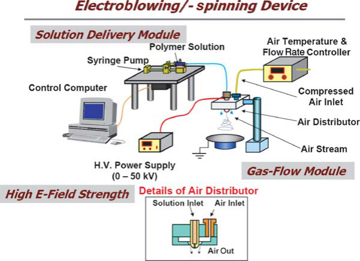

**Figure 10** Schematic diagram of the electroblowing/-spinning device. Without the pressurized gas flow, the unit becomes an electrospinning device (98, 100). Reproduced with permission from Reference 98. 

NANOFIBROUS MATERIALS **349** 

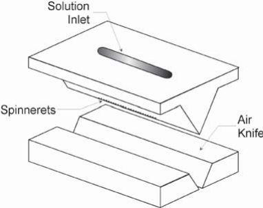

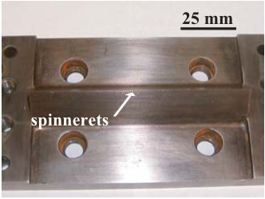

<!-- Start of picture text -->
25 mm spinnerets <!-- End of picture text -->

**Figure 11** Schematic diagram and photograph of the multiple-jet spinneret block in the prototype electroblowing device (100). 

by a speed-controlled blower while the air temperature is controlled by heating elements. Furthermore, the air temperatures at different locations of the pressurized gas flow system, which are dependent upon the air-flowing rate, were monitored to fine-tune the air temperature at the spinneret. 

Recently, scientists at STAR successfully demonstrated the installation and initial testing of a multiple-jet electroblowing apparatus (100). The prototype device contained a spinneret assembly with a linear density of 25 spinnerets inch−1 . 

The most critical part of the prototype multiple-jet electroblowing system is the spinneret block (shown in Figure 11), which was made of high-strength steel (for electrical conduction). The diameter of each spinneret hole was approximately 0.35 mm. The compressed air was introduced from the side of the spinneret block. The air inlet block was made of high-performance polyetheretherketone (PEEK, for electrical insulation) and could be operated at temperatures as high as 150◦ C. The air gaps could be adjusted such that the shear force of the compressed air could also be changed. The polymer solution was introduced into the inlet through the use of a constant-flow (or constant-pressure) pump. The spinneret block and the air knives were assembled in an enclosure so that the air could be uniformly blown out of the slit. The tip of the spinneret, which was the only part that was made of conducting material, was exposed to the “target” (ground). 

The assembled device was placed at an isolated platform, as shown in Figure 12. The conveyor belt was made of polyester mesh and driven by a speedtunable motor. The polymer solution was pumped into the device by a largediameter (26.6 mm) syringe pump with a variable computer-controlled flow rate. The distance _D_ between the spinneret tip and the grounding target could also be adjusted and was set to _D_ = 40 cm in the test. Three major problems were encountered with the above-described prototype electroblowing device: 

**350** BURGER■ HSIAO■ CHU 

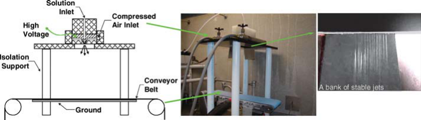

**Figure 12** Schematic diagram and photograph of multiple-jet electroblowing device on an isolated platform (100). 

1. Relatively large fiber diameters (500–1000 nm) were produced. 

2. The throughput per spinneret was about the same as for single-jet electrospinning. 

3. A large gas volume was used, which made the solvent recovery process more difficult. 

In blowing-assisted electrospinning (the electric force–dominated operation), the jet instability due to electrostatic repulsion inside the jet stream is an essential means to produce the very large SDR necessary for the production of truly submicron-diameter fibers. The essence of this technology is the use of temperature-controlled gas blowing not only as a dragging force but also as a critical variable to broaden the operating conditions (e.g., control the rates of solvent evaporation, polymer crystallization, and solidification). On the other hand, in electroblowing (in which the air-dragging force dominated the initial formation of the jet stream), the SDR induced by flowing gases is much smaller because the maximum gas velocity is likely to be less than the speed of sound, which limits the effectiveness of air-dragging force to reduce the fiber diameter when the fluid jet stream travels nearer to the collector. In this operation, the fiber diameter will become substantially larger, but the production throughput can approach a similar level as for melt blowing. 

One critical question is whether the throughput of blowing-assisted electrospinning can be increased to the same level as that of melt blowing. One can consider the following scenario. In electrospinning, a typical SDR is on the order of 106 . Consequently, for a production rate of ∼6 g of polymer/20 hrs/spinneret by using a 10 wt% polymer solution (density 1 g cm−3 ), and a cross-sectional area of 0.04 mm2 , the initial fluid velocity is 75 m h−1 . With a SDR of 106 , a final fiber cross-sectional area of 0.04 _μ_ m2 (diameter of approximately 200 nm), and taking into account that the polymer solution contains 90% solvent that will be evaporated, the final fiber speed reaching the collector should be ∼750 km h−1 , approximately the speed of an airplane. Thus, if we were to consider increasing the production rate per jet by a factor of only 10, the fiber speed would break the sound barrier, 

NANOFIBROUS MATERIALS **351** 

which is impractical in operation, long before it could reach the cross-sectional area of 0.04 _μ_ m2 . This illustration simply implies that, owing to the very small diameters of the fibers, the increase in the production rate can best be accomplished (in the absence of bifurcation of the jet stream) by the use of multiple jets, rather than a substantial increase of throughput per spinneret. Furthermore, we need to emphasize the use of electric force as the dominating factor that drags the jet stream to the collector. Although it is conceivable to have fiber speeds beyond the velocity of sound, the increasing air resistance will make a further speed increase very difficult. An alternative approach is to introduce bifurcation into the spinning process. This approach is feasible. However, fiber uniformity is likely to suffer. Thus, the final choice depends on specific needs on the fiber specifications. 

#### **3. APPLICATIONS** 

Reviewing the number of patents, one can see that approximately two-thirds of all electrospinning applications are in the medical field. Of the remaining patents, one-half deals with filtration applications, and all other applications share the remaining half. The potential applications of nanofibers have been reviewed, as shown schematically in Figure 13. A very broad range of applications—including life sciences, medical, and filtration applications as well as sensors, protective clothing, and masks—is covered. 

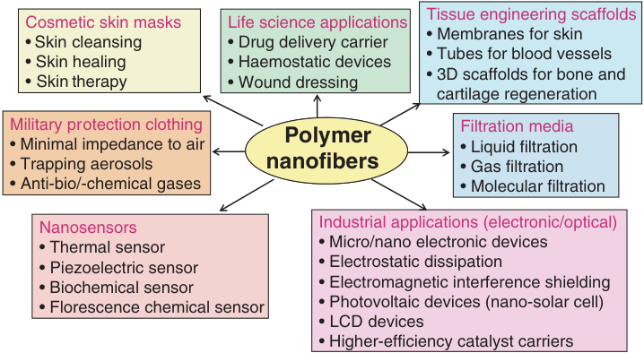

<!-- Start of picture text -->
Cosmetic skin masks  Life science applications Tissue engineering scaffolds • Membranes for skin • Skin cleansing • Drug delivery carrier • Tubes for blood vessels • Skin healing • Haemostatic devices • 3D scaffolds for bone and • Skin therapy • Wound dressing cartilage regeneration Military protection clothing Filtration media PolymerPolyme • Minimal impedance to air • Liquid filtration • Trapping aerosols nanofiber ss • Gas filtration • Anti-bio/-chemical gases • Molecular filtration Nanosensors Industrial applications (electronic/optical) • Thermal sensor • Micro/nano electronic devices • Piezoelectric sensor • Electrostatic dissipation • Biochemical sensor • Electromagnetic interference shielding • Florescence chemical sensor • Photovoltaic devices (nano-solar cell) • LCD devices • Higher-efficiency catalyst carriers <!-- End of picture text -->

**Figure 13** Potential applications of nanofibers. The main contributions are devoted to medical (tissue engineering), life science, and filtration applications (adapted from Reference 6). 

**352** BURGER■ HSIAO■ CHU 

#### **3.1. Composite Material Reinforcement** 

Just like other high-modulus fibrous materials (e.g., glass fibers, carbon fibers, carbon nanotubes), nanofibers electrospun from suitable high-modulus polymers, e.g., polybenzimidazole (PBI) (101), are promising candidates for composite material reinforcement that can take advantage of their high specific surface and good molecular alignment. However, unless there are further breakthroughs in scaling up the production rate of the electrospinning process, basic costs in capital investment in instrumentation and maintenance will remain important factors for this type of processing technique in industrial applications when compared with cheaper alternatives. 

Note also that fiber composite materials with a transparent matrix can remain relatively transparent (84) if the diameters of the reinforcing fibers are smaller than approximately one-tenth of the wavelength of visible light, whereas fiber composites with conventional micrometer-sized fibers are opaque. Again, reinforcement alone is not likely to be sufficient. The utility of nanofiber applications rests mainly with the ability to provide specific and unique properties, including those of sensors and drug carriers (Figure 13), that can be imbedded into the composites. 

#### **3.2. Filtration, Semipermeable Membranes, and Osmosis** 

The filter efficiency, in general, increases linearly with decreasing filter membrane thickness and increasing applied pressure. Thus, we can take advantage of the unique properties of electrospun membranes consisting of very-small-diameter fibers. As illustrated schematically in Figure 1, the electrospun nonwoven nanostructure ( _a_ ) has interconnected pores, ( _b_ ) has pore sizes of the order of only a few times to a few ten times the fiber diameter, and ( _c_ ) the pore space to material ratio is on the order of 3:1 or even higher. The combination of these three features implies a higher permeability (because of the large pore volume) that can withstand fouling better (because of the interconnection of the pores) and smaller pore sizes, implying that the electrospun nonwoven nanostructure can support even thinner coatings that are responsible for the actual fluid filtration. 

In fact, electrospun nonwoven fabrics, even without the top coating layer, are very efficient filters already, e.g., for air filters with few deposited nanofiber layers. Here, the relatively low production rate of the electrospinning process (when compared with that of fiber spinning in the textile industry) is not so serious because the quantity demand is within reach through the use of multiple jets, and for lower-quality controls, the use of bifurcation is within reach. The production of electrospun filter materials is usually expressed in terms of area coverage, and not of weight, suggesting that the key parameter in the efficiency of the filtration process is not the weight of the filter but the permeation of fluids passing through the filter (high flux) and the ability to keep the filter in operation (low fouling). 

A new three-tier concept on the filter design has been developed for ultrafiltration, as shown in Figure 14, in which both the base-layer support and the mid-layer 

NANOFIBROUS MATERIALS **353** 

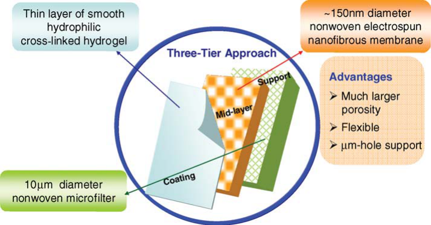

**Figure 14** New concept on high-flux, low-fouling membranes for ultrafiltration. 

substrate for the top-coating layer have the bicontinuous (interconnected pore) topology of nonwoven fabrics. 

Figure 14 also summarizes the advantages of using a nonwoven electrospun nanofibrous mid-layer membrane. Its micron-size-range pores permit the topcoating layer to be much thinner than conventional mid-layer substrates; this is commonly achieved by means of phase inversion to form a void-directed scaffold and because of the higher porosity of electrospun membranes. 

To provide a smooth top-coating layer, the final few layers of the nanofibrous structures can be electrospun with thinner diameter fibers, as shown in Figure 15. The introduction of an asymmetric mid-layer can further refine the optimization procedure in constructing a high-flux, low-fouling filter, because the low-fouling aspect of the filter is primarily due to the smoothness and its ability to reject unwanted components in the fluid by the top-coating layer. This top-coating layer should be as thin as possible but able to withstand the designed applied pressure and the shear force exerted by the fluid in cross-flow filtration. 

Figure 15 shows scanning electron micrographs (SEM) of the three layers used for an experimental ultrafiltration membrane in which a melt-blown nonwoven polyester base support, a PAN electrospun mid-layer, and a top-coating layer of chitosan illustrate the dimensional size change of the fibers in a three-tier construct. Themid-layerhasusedfibersoftwodifferentdiameters;thesmallerdiameterfibers are near the top-coating layer to provide a smoother surface and smaller pore size for the very thin top-coating layer. The mid-layer SEM shows some features of this approach. One way to accomplish these features is by changing the PAN solution concentration during the electrospinning process. A cross section of the top layer, the intermediate region between the top layer and the mid-layer, and a top region of 

**354** BURGER■ HSIAO■ CHU 

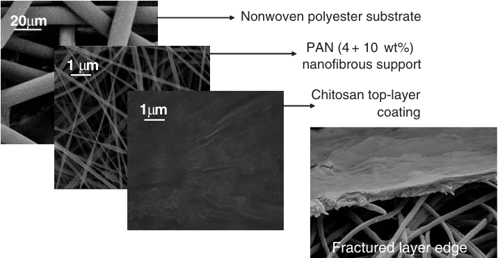

<!-- Start of picture text -->
20 μ m Nonwoven polyester substrate PAN (4 + 10 wt%) 1  μ m nanofibrous support Chitosan top-layer 1 μ m coating Fractured layer edge <!-- End of picture text -->

**Figure 15** Scanning electron micrographs (SEM) of the three-tier ultrafiltration membrane with inset, showing the fractured layer edge between the top layer and the mid-layer (unpublished data; figure designed by Kyunghwan Yoon at Stony Brook). 

the mid-layer are shown in Figure 15 (inset). The SEM photograph was obtained by fracturing the membrane in liquid nitrogen. It is clear that lamination of the top-coating layer and the mid-layer can be technically refined further. 

Depending on the chemical composition of the mid-layer and the top-coating layer, a much higher flux by a factor of 10 or more has been demonstrated through the use of this three-tier concept. The same approach obviously can be applied to other forms of ultrafiltration processes, including the treatment of produced water, ballast water, and desalination. The potential impact to this field could be extensive. In desalination, the functions of the top layer are to exclude salt and to let water pass through. Thus, the top layer functions differently from ultrafiltration of bilge water (waste water from ships). In desalination, the exclusion acts on salt by reverse osmosis, whereas for bilge water, the exclusion applies mainly for oil and surfactants. Clearly, the polymer network mesh sizes are smaller for desalination, and the nature of the polymer is different for these two cases. 

Fabrics for protected clothing applications are usually laminated together from different fibrous layers sharing many specific tasks such as mechanical support, resistance against convective air flow and moisture transport, and adsorption layers to trap airborne particles (80, 102). The electrospun nanofibrous layers usually consist of elastomeric nanofibers, combining some required flexibility in shape with sufficient tensile strength. The electrospun layers are, of course, also responsible for the filtering properties of the protective laminated fabrics. They also require low impedance to water-vapor diffusion; this is a significant improvement compared with protective clothing containing a layer of activated carbon, which has poor water-vapor permeability. 

NANOFIBROUS MATERIALS **355** 

#### **3.3. Scaffolds for Tissue Engineering** 

Research in the construction and optimization of various biocompatible scaffolds has grown tremendously in recent years. The utilization of biomaterials—both natural and synthetic—enables researchers to develop scaffolds that can be specifically designed for many medical applications, such as functional tissue scaffolds for organ regeneration (103, 104). The production methods used in creating such scaffolds are wide ranging, and each method has its unique characteristics. Recently, electrospinning has been demonstrated as a successful means of producing scaffolds that have many of the controllable desirable properties and are capable of sustaining cell viability (71, 105, 106). The advantages of an electrospun scaffold include an extremely high (favorable) surface-to-volume ratio, appropriate porosity, and malleability to conform to a wide variety of sizes, textures, and shapes. In addition, scaffold composition and fabrication can be controlled to conform to specific desired properties and functionality. Scaffold structure and morphology can also be altered postproduction to closely match those of native tissues, mimicking the native physiological environment at, for example, an injury site. 

The utilization of electrospun scaffolds as cell delivery vehicles has been substantially increased in recent years owing, in part, to the physical similarities between the nanofibrous scaffolds and the extracellular matrix (ECM) found in native tissues. The inherent architecture of electrospun scaffolds provides a favorable substrate to more accurately assess cellular behavior in vitro. Furthermore, whereas other well-established manufacturing techniques have been used to thoroughly investigate their efficacy in producing viable cell scaffolds, electrospinning affords the ability to precisely control a vast array of parameters in tailoring the scaffold for specific biomedical applications ranging from preventing postoperative adhesions to stimulating tissue regeneration. 

Beyond the diverse array of synthetic polymers used as primary components of electrospun scaffolds (107–113), some investigators have moved toward replacing the relatively inexpensive synthetic polymers for naturally occurring polymers that exist in the human body to further replicate the native environment of the host tissue. Thus, the scaffold would be constructed with the predominant protein(s) that are present in the ECM. For example, poly(amino acid)s [e.g., poly(aspartic acid)] have been investigated as to serving as a bioactive moiety in polymeric scaffolds (114). For these scaffolds, the presence of poly(aspartic acid) was beneficial for osteoblast adhesion, proliferation, and differentiation after seven days. Another example is collagen nanofibers; type I and type III collagen are the predominant structural elements of the ECM in many tissues. The electrospun fibers closely resemble the natural dimensions and architecture of collagen fibrils making up the ECM and support cell growth and penetration within the scaffold (71). Our group has demonstrated the efficacy of such a scaffold by incorporating only trace amounts of type I collagen from calf skin into a poly(L-lactic acid) (PLLA) polymer solution prior to fabrication. SEM analyses of collagen/PLLA electrospun 

**356** BURGER■ HSIAO■ CHU 

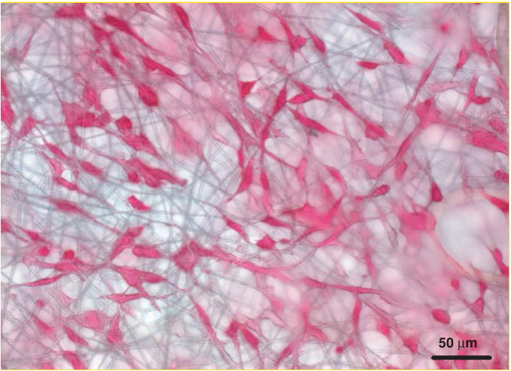

<!-- Start of picture text -->
50  μ m <!-- End of picture text -->

**Figure 16** Pre-osteoblastic murine calvaria cells (MC3T3-E1) seeded onto an electrospun PLLA + type I collagen (unpublished data; experiment performed by Jonathan Chiu under the supervision of M. Hadjiargyrou, B. Hsiao, & B. Chu at Stony Brook). 

fibers revealed no apparent morphological differences. Furthermore, the inclusion of collagen within the PLLA fibers facilitated robust osteoblast adhesion (Figure 16). 

The immunogenic response was found to be no more significant than other synthetic (e.g., PLGA) scaffolds that have been implanted in vivo. The feasibility of mass-producing pure collagen (or any other ECM protein) scaffolds would be questionable, as this would require a major financial commitment relative to synthetic polymers that can be purchased in bulk at relatively lower costs. The above results suggest that a combination of the two, where an electrospun scaffold contains both synthetic and natural polymers, may enhance both physical and biological functionalities, as it can take advantage of favorable properties (strength/durability, cell attachment enhancement) of both components. Indeed, researchers investigating scaffolds that incorporate both synthetic and natural polymers have reported a combinatory effect of enhancing cell adhesion by modifying poly(lactic acid) (PLA) or poly(glycolic acid) (PGA) derivatives with collagen (115, 116). Further studies examining the precise polymeric interactions within 

NANOFIBROUS MATERIALS **357** 

electrospun nanofibers and their subsequent effects on cellular behavior are warranted. 

#### **3.4. Electrospun Scaffolds for Delivery of Bioactive Agents** 

With the massive proliferation in the primary literature on electrospinning, a relatively small amount of these reported data deals specifically with the use of the technology in the delivery of bioactive molecules (drugs, proteins, and DNA). Researchers in this nascent field have started to demonstrate rapid progress and understanding of the factors involved in the formulation, incorporation, and controlled, sustained release of a repertoire of molecules with vastly different characteristics. Undoubtedly, more data and reports—further demonstrating the efficacy of using electrospinning in the generation and production of biodegradable scaffolds capable of delivering bioactive molecules—will follow this review. Owing to the solvent requirements in the electrospinning process, whereby the majority of polymers utilized require dissolution in organic solutions, e.g., N,Ndimethylformamide (DMF), tetrahydrofuran (THF), and hexafluoroisopropanol (HFTP), with low aqueous content, the challenges faced in the formulation and incorporation of bioactive molecules need to be addressed separately for hydrophobic, hydrophilic, and charged molecules. 

In the case of DNA delivery, our lab published the first report of successful DNA incorporation and release from an electrospun scaffold (105). Plasmid DNA encoding for the marker gene _β_ -galactosidase was successfully incorporated and released in a controlled and sustained fashion. Specifically, we observed a peak at 5 days of ∼80% of the initially loaded DNA, with sustained, albeit diminished, release up to 20 days. More importantly, the DNA was established as structurally intact (Figure 17, left panel) and having retained biological activity (Figure 17, right panel). The released DNA was capable of transfecting cells in vitro when it was collected post release and then added to the cell culture, as well as when scaffolds were added to the medium (Figure 17, right panel). In more recent experiments, we have been able to increase the transfection efficiency by directly planting cells on DNA-containing scaffolds. These results represent a significant step toward the development of a clinically relevant gene-delivery vehicle, as many of the current gene-delivery systems now studied often utilize cytotoxic compounds to achieve and/or enhance transfection. 

We have postulated that the transfection of cells seeded directly onto the scaffold opens up a new avenue for guided tissue engineering—in situ tissue engineering via gene delivery. With this bioactive scaffold that can deliver molecular signals released in a temporally and spatially controlled manner, it potentially would be possible to direct the development of seeded cells into functional tissue, after implantationintoabiologicalsite.Utilizingelectrospunscaffoldsthathaverepeatedly been reported as ideal for cell growth and development, and imparting them with 

**358** BURGER■ HSIAO■ CHU 

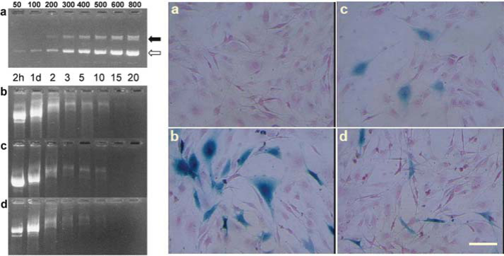

**Figure 17** Electrophoretic analysis demonstrated that DNA released from electrospun scaffolds was intact ( _left panel_ ) and capable of cellular transfection ( _right panel_ ). ( _Left panel_ ) ( _a_ ) Control plasmid. ( _b_ , _c_ , _d_ ) Released plasmid at various time points from PLGA-based scaffolds containing 10%, 12%, and 15% block copolymer, respectively. ( _Right panel_ ) ( _a_ ) Naked DNA (2 _μ_ g) added directly to the cell medium. ( _b_ ) Cells transfected with complexed control DNA (2 _μ_ g) with a lipid-based transfection reagent (Fugene6). ( _c_ ) Two 1.5 × 1 cm sections of scaffold were directly incubated with cells for 4 hrs, then removed. ( _d_ ) Released DNA from scaffold (2 _μ_ g) complexed with Fugene6. Reproduced with permission from Reference 105. 

gene-delivery functionality, offer an integrated approach to the complex process of tissue engineering. 

#### **3.5. Anti-Adhesion Barrier Membranes** 

For the past decade, abdominal adhesions have become increasingly commonplace as a side effect of surgical procedures that result in postoperative complications, translating into roughly $1.3 billion in direct medical costs in the United States (117). Trauma, inflammation, and infection are major factors in the prevalence of postoperative adhesions that typically occur in either the digestive or reproductive tracts. As synthetic polymers for use in biomedical applications have become more acceptable within the scientific and medical communities, products from both research and commercial arenas have served as viable barriers for tissue formation (118, 119). These barriers are typically in film or mesh form, and although recent publications report success in varying degrees, these membranes present many limitations ranging from requiring yet another surgical procedure to remove the barrier itself to inducing further inflammatory reactions at the injury site. Thus, there remains a substantial need for the production of a low-cost, highly 

NANOFIBROUS MATERIALS **359** 

efficient bioabsorbable barrier to prevent postoperative adhesions that will reduce inflammation, prevent infection, and inertly degrade away once its function has been fulfilled. 

Our group has demonstrated that prior to electrospinning, drugs, either as is or encapsulated, can be mixed in with the polymer solution such that as the fibers degrade, the drugs are released in a controlled, sustained manner. This localization of drug delivery greatly improves upon the current methods of oral or systemic administration of antibiotics to minimize infections at the injury site. Under current methods, a significant increase in dosage must be prescribed because of the inevitable dilution of drugs as they travel through the bloodstream to the target site. Furthermore, we recently demonstrated in a rat model that a drug-loaded (cefoxitin sodium), PLGA-based, electrospun membrane completely inhibited any adhesion formation after 28 days (120) (see Table 1). These remarkable results were better than for either the PLGA membrane alone or the PLGA-based membrane; the latter two membranes have already demonstrated favorable rates of anti-adhesion (22% and 25%, respectively). The inclusion of antibiotics from this study would suggest that contamination and subsequent infection at the wound site would be causes of adhesion formation. More extensive research using larger-scale models must be conducted, but the successful implementation of drug-loaded electrospun nanofibrous membranes as a decisive modality in adhesion prevention paves the pathway for a new class of barriers that improves upon the existing commercial products. 

#### **3.6. Other Applications** 

High surface areas combined with the flow of ion-conducting electrolytes through electrically conducting nanofiber mats make electrospun materials attractive as electrodes for batteries or electrochemical supercapacitor applications. Electrospun materials investigated for this purpose include carbon nanofibers (121–124) and poly(vinylidene fluoride) (PVDF) (125). 

Electrospun titania (TiO2) nanofibers, annealed to achieve the anatase or rutile phase and doped with erbium III oxide particles added before electrospinning, may be used as highly efficient and selective emitters for thermophotovoltaic applications (126). 

Catalyst supports, for which catalysis could be inorganic, organic, and especially biological (i.e., involving enzymes) in nature, need a high surface area combined with high porosity and good transport properties. Again, electrospun nonwoven mats can offer this combination of properties. Jia et al. (127) demonstrated the attachment of a model enzyme, _α_ -chymotrypsin, to electrospun polystyrene nanofibers and observed good enzymatic activity and stability. After immobilization of cellulase in nanofibrous PVA membranes, more than 65% of the activity of the free enzyme was retained (128). 

Electronspun nanofibrous materials have been investigated for use in nanosensor applications, taking advantage of their high surface area and good transport 

**360** BURGER■ HSIAO■ CHU 

**TABLE 1** Comparison of adhesions (score of adhesions and number of rats that had adhesions) between treated groups with electrospun PLGA-based membranes and their corresponding controls 

||Score1|Control (_n_ = 9)|PLGA (_n_ = 10)|PLGA+PEG-PLA (_n_ = 9)|
|---|---|---|---|---|
||0|2|6|7|
||1|0|0|0|
|Experiment #1|2|0|1|0|
||3|7|3|2 |
||Mean score|2.3|1.1|0.7ζ |
||Total (percentage) with adhesions|7 (78%)|4 (40%)|2 (22%)ζ|
|||||PLGA with|
|||Control||Cefoxitin|
||Score1|(_n_ = 12)|PLGA (_n_ = 12)|sodium (_n_ = 12)|
||0|4|6|9|
||1|0|1|0|
|Experiment #2|2|1|1|0|
||3|7|4|3|
||Mean score|1.9|1.2|0.7ζ|
||Total (percentage)|8 (67%)|6 (50%)|3 (25%)ζ|
||with adhesions||||
|||||PLGA+PEG-PLA|
|||Control|PLGA+PEG-PLA|with Cefoxitin sodium|
||Score1|(_n_ = 6)|(_n_ = 12)|(_n_ = 12)|
||0|0|8|12|
||1|1|0|0|
|Experiment #3|2|0|3|0|
||3|5|1|0|
||Mean score|2.7|0.7|0.0ζ |
||Total (percentage) with adhesions|6 (100%)|4 (33%)|0 (0%)ζ|

1Score 0: no adhesion; 1: thin and filmy; 2: significant and filmy; 3: severe with fibrosis. ζ: statistically significant difference with control group (Fisher exact _t_ -test with threshold probability 0.05). Adapted from Reference 120. 

properties needed for efficient molecule detection (129–131) as well as for optical sensors (132). 

Electrospun nonwoven mats can be used as wing skins for the wings of microair vehicles (MAV) (133, 134), an application that makes use of their extremely light weight, in a sense mimicking insect wings like those of a dragonfly. Such an innovative application is interesting. It is up to the reader’s imagination to come 

NANOFIBROUS MATERIALS **361** 

up with other uses such as this one, although the ultimate benefit to society is a separate matter. 

#### **4. CONCLUSIONS** 

Within the past several years, there has been an explosive growth in published reports on the use of electrospinning as a method of generating nanofiber scaffolds. The specific advantages of electrospun scaffolds (high surface-to-volume ratio, controlled porosity, and flexibility to conform to a wide variety of sizes and shapes) make them superior to scaffolds generated by most other techniques for a wide variety of applications. In addition, electrospun scaffold composition and fabrication can be used to provide functionality. Even after fabrication, the physical properties of scaffolds can further be altered by postprocessing, e.g., to closely match those of native tissues or to achieve textures suitable for cell attachment, penetration, and proliferation. Collectively, these advantages are reflected in the wide diversity of scaffolds generated with the intended purposes from biomedical applications to filtration. In this review, we summarize recent advances made in understanding the fundamentals of electrospinning and related techniques, as well as the physical limitations on scale-up productions and potential mass-production schemes. The applications of electrospun scaffolds in various fields are numerous, as summarized in Figure 13. The combination of physical structure and chemical composition, together with the kinetic processing approach of nanofibrous materials, allow these materials to achieve many unique properties suitable for a broad range of applications. 

Nanofibrous materials offer unique features and have generated many interesting und useful applications. There is room for much improvement in processing technologies, especially regarding the formation of three-dimensional constructs and incorporation of molecules/particles for subsequent controlled release. Although three-dimensional macroscopic structures can be fabricated, the current processing technology based on applied electric fields and gas blowing forces will always lead to a fiber deposition that forms, in essence, a two-dimensional structure. Controlled release of drugs, proteins, and genes again requires specific designs, depending on the nature of the incorporated materials and the desired release profile. There are many challenges waiting to be overcome. 

###### **ACKNOWLEDGMENTS** 

Financial support of this work was provided by the National Institutes of HealthSBIR grant (GM63283-02) administered by STAR, as well as by the Center of Biotechnology at New York. Ben Chu also acknowledges support by the National Science Foundation (DMR 9984102 and 0454887). The technical assistance of 

**362** BURGER■ HSIAO■ CHU 

Drs. Dufei Fang, Qicong Ying, Xuefeng Wang, Kwangsok Kim, In Chul Um, Steven Xinhua Zong, Kyunghwan Yoon, Jonathan Chiu, Michael Hadjiargyrou, and Collin Brathwaite is gratefully acknowledged. 

###### **The** **_Annual Review of Materials Research_ is online at http://matsci.annualreviews.org** 

###### **LITERATURE CITED** 

1. Liu T, Burger C, Chu B. 2003. Nanofabrication in polymer matrices. _Progr. Polym. Sci._ 28:5–26 

2. Zeleny J. 1914. The electrical discharge from liquid points, and a hydrostatic method of measuring the electric intensity at their surfaces. _Phys. Rev._ 3:69–91 

3. Formhals A. 1934. Process and apparatus for preparing artificial threads. U.S. Patent No. 1,975,504 

4. Taylor GI. 1969. Electrically driven jets. _Proc. R. Soc. Lond. Ser. A_ 313:453–75 

5. Reneker DH, Chun I. 1996. Nanometre diameter fibres of polymer, produced by electrospinning. _Nanotechnology_ 7:216– 23 

6. Huang ZM, Zhang YZ, Kotaki M, Ramakrishna S. 2003. A review on polymer nanofibers by electrospinning and their applications in nanocomposites. _Compos. Sci. Technol._ 63:2223–53 

7. Frenot A, Chronakis IS. 2003. Polymer nanofibers assembled by electrospinning. _Curr. Opin. Colloid Interface Sci._ 8:64–75 

8. Li D, Xia YN. 2004. Electrospinning of nanofibers: reinventing the wheel? _Adv. Mater._ 16:1151–70 

9. Nair LS, Bhattacharyya S, Laurencin CT. 2004. Development of novel tissue engineering scaffolds via electrospinning. _Expert Opin. Biol. Ther._ 4:659– 68 

10. Jayaraman K, Kotaki M, Zhang YZ, Mo XM, Ramakrishna S. 2004. Recent advances in polymer nanofibers. _J. Nanosci. Nanotechnol._ 4:52–65 

11. Ma ZW, Kotaki M, Inai R, Ramakrishna 

   - S. 2005. Potential of nanofiber matrix as tissue-engineering scaffolds. _Tissue Eng._ 11:101–9 

12. Subbiah T, Bhat GS, Tock RW, Pararneswaran S, Ramkumar SS. 2005. Electrospinning of nanofibers. _J. Appl. Polym. Sci._ 96:557–69 

13. Chiu JB, Luu YK, Hsiao BS, Chu B, Hadjiargyrou M. 2005. Electrospun nanofibrous scaffolds for biomedical applications. _J. Biomed. Nanotech._ 1:115– 32 

14. Larrondo L, Manley RSJ. 1981. Electrostatic fiber spinning from polymer melts. 1. Experimental-observations on fiber formation and properties. _J. Polym. Sci. B_ 19:909–20 

15. Larrondo L, Manley RSJ. 1981. Electrostatic fiber spinning from polymer melts. 2. Examination of the flow field in an electrically driven jet. _J. Polym. Sci. B_ 19:921–32 

16. Larrondo L, Manley RSJ. 1981. Electrostatic fiber spinning from polymer melts. 3. Electrostatic deformation of a pendant drop of polymer melt. _J. Polym. Sci. B_ 19:933–40 

17. Rangkupan R, Reneker DH. 2003. Electrospinning process of molten polypropylene in vacuum. _J. Met. Mater. Miner._ 12:81–87 

18. Fabbricante AS, Fabbricante TJ, Najour G. 1997. U.S. Patent No. 5679379 

19. Fabbricante AS, Ward GF, Fabbricante TJ. 2000. U.S. Patent No. 6114017 

20. Taylor GI. 1964. Disintegration of water drops in electric field. _Proc. R. Soc. Lond. Ser. A_ 280:383–97 

NANOFIBROUS MATERIALS **363** 

21. Yarin AL, Koombhongse S, Reneker DH. 2001. Taylor cone and jetting from liquid droplets in electrospinning of nanofibers. _J. Appl. Phys._ 90:4836–46 

22. Doshi J, Reneker DH. 1995. Electrospinning process and applications of electrospun fibers. _J. Electrost._ 35:151–60 

23. Rayleigh L. 1882. On the equilibrium of liquid conducting masses charged with electricity. _Philos. Mag._ 14:184–86 

24. McKee MG, Layman JM, Cashion MP, Long TE. 2006. Phospholipid nonwoven electrospin membranes. _Science_ 311:353–55 

25. Deitzel JM, Kleinmeyer J, Harris D, Tan NCB. 2001. The effect of processing variables on the morphology of electrospun nanofibers and textiles. _Polymer_ 42:261–72 

26. Zong XH, Kim K, Fang D, Ran S, Hsiao BS, Chu B. 2002. Structure and process relationship of electrospun bioabsorbable nanofiber membranes. _Polymer_ 43:4403–12 

27. Loscertales IG, Barrero A, Guerrero I, Cortijo R, Marquez M, Ganan-Calvo AM. 2002. Micro/nano encapsulation via electrified coaxial liquid jets. _Science_ 295:1695–98 

28. Fenn JB, Mann M, Meng CK, Wong SF, Whitehouse CM. 1990. Electrospray ionization-principles and practice. _Mass Spectrom. Rev._ 9:37–70 

29. Fenn JB, Mann M, Meng CK, Wong SF, Whitehouse CM. 1989. Electrospray ionization for mass-spectrometry of large biomolecules. _Science_ 246:64– 71 

30. Tanaka K, Waki H, Ido Y, Akita S, Yoshida Y, Yoshida T. 1988. Protein and polymer analyses up to m/z 100,000 by laser ionization time-of-flight mass spectrometry. _Rapid Comm. Mass Spectr._ 2:151–53 

31. Larsen G, Velarde-Ortiz R, Minchow K, Barrero A, Loscertales IG. 2003. A method for making inorganic and hybrid (organic/inorganic) fibers and vesi- 

cles with diameters in the submicrometer and micrometer range via sol-gel chemistry and electrically forced liquid jets. _J. Am. Chem. Soc._ 125:1154–55 

32. Zhang G, Kataphinan W, Teye-Mensah R, Katta P, Khatri L, et al. 2005. Electrospun nanofibers for potential spacebased applications. _Mater. Sci. Eng. B_ 116:353–358 

33. Zong XH, Ran S, Fang D, Hsiao BS, Chu B. 2003. Control of structure, morphology and property in electrospun poly (glycolide- _co_ -lactide) non-woven membranes via post-draw treatments. _Polymer_ 44:4959–67 

34. Smit E, Buttner U, Sanderson RD. 2005. Continuous yarns from electrospun fibers. _Polymer_ 46:2419–23 

35. Reneker DH, Yarin AL, Fong H, Koombhongse S. 2000. Bending instability of electrically charged liquid jets of polymer solutions in electrospinning. _J. Appl. Phys._ 87:4531–47 

36. Yarin AL, Koombhongse S, Reneker DH. 2001. Bending instability in electrospinning of nanofibers. _J. Appl. Phys._ 89:3018–26 

37. Shin YM, Hohman MM, Brenner MP, Rutledge GC. 2001. Experimental characterization of electrospinning: the electrically forced jet and instabilities. _Polymer_ 42:9955–67 

38. Hohman MM, Shin M, Rutledge G, Brenner MP. 2001. Electrospinning and electrically forced jets. I. Stability theory. _Phys. Fluids_ 13:2201–20 

39. Hohman MM, Shin M, Rutledge G, Brenner MP. 2001. Electrospinning and electrically forced jets. II. Applications. _Phys. Fluids_ 13:2221– 36 

40. Shin YM, Hohman MM, Brenner MP, Rutledge GC. 2001. Electrospinning: a whipping fluid jet generates submicron polymer fibers. _Appl. Phys. Lett._ 78:1149–51 

41. Fridrikh SV, Yu JH, Brenner MP, Rutledge GC. 2003. Controlling the fiber 

**364** BURGER■ HSIAO■ CHU 

   - diameter during electrospinning. _Phys. Rev. Lett._ 90:144502 

42. Baumgarten PK. 1971. Electrostatic spinning of acrylic microfibers. _J. Colloid Interface Sci._ 36:71 

43. Kim JS, Lee DS. 2000. Thermal properties of electrospun polyesters. _Polym. J._ 32:616–18 

44. Lee KH, Kim HY, Bang HJ, Jung YH, Lee SG. 2003. The change of bead morphology formed on electrospun polystyrene fibers. _Polymer_ 44:4029–34 

45. Lee KH, Kim HY, La YM, Lee DR, Sung NH. 2002. Influence of a mixing solvent with tetrahydrofuran and N,N-dimethylformamide on electrospun poly(vinyl chloride) nonwoven mats. _J. Polym. Sci. B_ 40:2259–68 

46. Fong H, Liu WD, Wang CS, Vaia RA. 2002. Generation of electrospun fibers of nylon 6 and nylon 6-montmorillonite nanocomposite. _Polymer_ 43:775–80 

47. Ding B, Kim HY, Lee SC, Shao CL, Lee DR. et al. 2002. Preparation and characterization of a nanoscale poly(vinyl alcohol) fiber aggregate produced by an electrospinning method. _J. Polym. Sci. B_ 40:1261–68 

48. Ding B, Kim HY, Lee SC, Lee DR, Choi KJ. 2002. Preparation and characterization of a nanoscale poly(vinyl alcohol) fibers via electrospinning. _Fibers Polym._ 3:73–79 

49. Zhang CX, Yuan XY, Wu LL, Han Y, Sheng J. 2005. Study on morphology of electrospun poly(vinyl alcohol) mats. _Eur. Polym. J._ 41:423–42 

50. Reneker DH, Kataphinan W, Theron A, Zussman E, Yarin AL. 2002. Nanofiber garlands of polycaprolactone by electrospinning. _Polymer_ 43:6785–94 

51. Lee KH, Kim HY, Khil MS, Ra YM, Lee DR. 2003. Characterization of nano-structured poly(epsiloncaprolactone) nonwoven mats via electrospinning. _Polymer_ 44:1287–94 

52. Srinivasan G, Reneker DH. 1995. Structure and morphology of small-diameter 

   - electrospun aramid fibers. _Polym. Int._ 36:195–201 

53. Zhao ZZ, Li JQ, Yuan XY, Li X, Zhang YY, Sheng J. 2005. Preparation and properties of electrospun poly(vinylidene fluoride) membranes. _J. Appl. Polym. Sci._ 97:466–74 

54. Kim JS, Reneker DH. 1999. Polybenzimidazole nanofiber produced by electrospinning. _Polym. Eng. Sci._ 39: 849–54 

55. Demir MM, Yilgor I, Yilgor E, Erman B. 2002. Electrospinning of polyurethane fibers. _Polymer_ 43:3303–9 

56. Cha DI, Kim HY, Lee KH, Jung YC, Cho JW, Chun BC. 2005. Electrospun nonwovens of shape-memory polyurethane block copolymers. _J. Appl. Polym. Sci._ 96:460–65 

57. Krishnappa RVN, Desai K, Sung CM. 2003. Morphological study of electrospun polycarbonates as a function of the solvent and processing voltage. _J. Mater. Sci._ 38:2357–65 

58. Shawon J, Sung CM. 2004. Electrospinning of polycarbonate nanofibers with solvent mixtures THF and DMF. _J. Mater. Sci._ 39:4605–13 

59. YuanXY,ZhangYY,DongCH,ShengJ. 2004. Morphology of ultrafine polysulfone fibers prepared by electrospinning. _Polym. Int._ 53:1704–10 

60. Kenawy ER, Abdel-Fattah YR. 2002. Antimicrobialpropertiesofmodifiedand electrospun poly(vinyl phenol). _Macromol. Biosci._ 2:261–66 

61. Fong H, Reneker DH. 1999. Elastomeric nanofibers of styrene-butadiene-styrene triblock copolymer. _J. Polym. Sci. B_ 37:3488–93 

62. Chun I, Reneker DH, Fong H, Fang XY, Dietzel J, Tan NB, Kearns K. 1999. Carbon nanofibers from polyacrylonitrile and mesophase pitch. _J. Adv. Mater._ 31:36–41 

63. Macdiarmid AG, Jones WE, Norris ID, Gao J, Johnson AT, et al. 2001. Electrostatically-generated nanofibers 

NANOFIBROUS MATERIALS **365** 

of electronic polymers. _Synth. Met._ 119:27–30 

64. Ge JJ, Hou HQ, Li Q, Graham MJ, Greiner A, et al. 2004. Assembly of wellaligned multiwalled carbon nanotubes in confined polyacrylonitrile environments: electrospun composite nanofiber sheets. _J. Am. Chem. Soc._ 126:15754–61 

65. Hou HQ, Ge JJ, Zeng J, Li Q, Reneker DH, et al. 2005. Electrospun polyacrylonitrile nanofibers containing a high concentration of well-aligned multiwall carbon nanotubes. _Chem. Mater._ 17:967–73 

66. Chung GS, Jo SM, Kim BC. 2005. Propertiesofcarbonnanofiberspreparedfrom electrospun polyimide. _J. Appl. Polym. Sci._ 97:165–70 

67. Norris ID, Shaker MM, Ko FK, Macdiarmid AG. 2000. Electrostatic fabrication of ultrafine conducting fibers: polyaniline/polyethylene oxide blends. _Synth. Met._ 114:109–14 

68. Liu HQ, Hsieh YL. 2002. Ultrafine fibrous cellulose membranes from electrospinning of cellulose acetate. _J. Polym. Sci. B_ 40:2119–29 

69. Kim CW, Frey MW, Marquez M, Joo YL. 2005. Preparation of submicronscale, electrospun cellulose fibers via direct dissolution. _J. Polym. Sci. B_ 43:1673–83 

70. Huang L, Nagapudi K, Apkarian RP, Chaikof EL. 2001. Engineered collagenPEO nanofibers and fabrics. _J. Biomater. Sci. Polym. Ed._ 12:979–93 

71. Matthews JA, Wnek GE, Simpson DG, Bowlin GL. 2002. Electrospinning of collagen nanofibers. _Biomacromolecules_ 3:232–38 

72. Ki CS, Baek DH, Gang KD, Lee KH, Um IC, Park YH. 2005. Characterization of gelatin nanofiber prepared from gelatinformic acid solution. _Polymer_ 46:5094– 102 

73. Zhang YZ, Ouyang HW, Lim CT, Ramakrishna S, Huang ZM. 2005. Electrospinning of gelatin fibers and 

   - gelatin/PCL composite fibrous scaffolds. _J. Biomed. Mater. Res._ 72B:156–65 

74. Blasinska A, Krucinska I, Chrzanowski M. 2004. Dibutyrylchitin nonwoven biomaterials manufactured using electrospinning method. _Fibres Text. East. Eur._ 12:51–55 

75. Duan B, Dong CH, Yuan XY, Yao KD. 2004. Electrospinning of chitosan solutions in acetic acid with poly(ethylene oxide). _J. Biomater. Sci. Polym. Ed._ 15:797–811 

76. Jiang HL, Fang D, Hsiao BJ, Chu BJ, Chen WL. 2004. Preparation and characterization of ibuprofenloaded poly(lactide- _co_ -glycolide)/poly(ethylene glycol)-G-chitosan electrospun membranes. _J. Biomater. Sci. Polym. Ed._ 15:279–96 

77. Geng XY, Kwon OH, Jang JH. 2005. Electrospinning of chitosan dissolved in concentrated acetic acid solution. _Biomaterials_ 26:5427–32 

78. Fang X, Reneker DH. 1997. DNA fibers by electrospinning. _J. Macromol. Sci. Phys. B_ 36:169–73 

79. Buchko CJ, Chen LC, Shen Y, Martin DC. 1999. Processing and microstructural characterization of porous biocompatible protein polymer thin films. _Polymer_ 40:7397–407 

80. Schreuder-Gibson H, Gibson P, Senecal K, Sennett M, Walker J, et al. 2002. Protective textile materials based on electrospun nanofibers. _J. Adv. Mater._ 34: 44–55 

81. Bognitzki M, Czado W, Frese T, Schaper A, Hellwig M, et al. 2001. Nanostructured fibers via electrospinning. _Adv. Mater._ 13:70 

82. Megelski S, Stephens JS, Chase DB, Rabolt JF. 2002. Micro- and nanostructured surface morphology on electrospun polymer fibers. _Macromolecules_ 35:8456–66 

83. Fong H, Chun I, Reneker DH. 1999. Beaded nanofibers formed during electrospinning. _Polymer_ 40:4585–92 

**366** BURGER■ HSIAO■ CHU 

84. Bergshoef MM,VancsoGJ.1999.Transparent nanocomposites with ultrathin, electrospun nylon-4,6 fiber reinforcement. _Adv. Mater._ 11:1362–65 

85. Koombhongse S, Liu WX, Reneker DH. 2001. Flat polymer ribbons and other shapes by electrospinning. _J. Polym. Sci. B_ 39:2598–606 

86. Sun ZC, Zussman E, Yarin AL, Wendorff JH, Greiner A. 2003. Compound core-shell polymer nanofibers by coelectrospinning. _Adv. Mater._ 15:1929–32 

87. Li D, Xia YN. 2004. Direct fabrication of composite and ceramic hollow nanofibers by electrospinning. _Nano Lett._ 4:933–38 

88. Li D, Mccann JT, Xia YN. 2005. Use of electrospinning to directly fabricate hollow nanofibers with functionalized inner and outer surfaces. _Small_ 1:83–86 

89. Mccann JT, Li D, Xia YN. 2005. Electrospinning of nanofibers with core-sheath, hollow, or porous structures. _J. Mater. Chem._ 15:735–38 

90. Li D, Wang YL, Xia YN. 2003. Electrospinning of polymeric and ceramic nanofibers as uniaxially aligned arrays. _Nano Lett._ 3:1167–71 

91. Li D, Wang YL, Xia YN. 2004. Electrospinning nanofibers as uniaxially aligned arrays and layer-by-layer stacked films. _Adv. Mater._ 16:361–66 

92. Li D, Ouyang G, Mccann JT, Xia YN. 2005. Collecting electrospun nanofibers with patterned electrodes. _Nano Lett._ 5:913–16 

93. Dalton PD, Klee D, M¨oller M. 2005. Electrospinning with dual collection rings. _Polymer_ 46:611–14 

94. Fang D, Chu B, Hsiao B. 2003. Multiple-jet electrospinning of nonwoven nanofiber articles. _Abstr. Pap. Am. Chem. Soc._ 226:U424 

95. Chu B, Hsiao BS, Fang D. 2004. Apparatus and methods for electrospinning polymeric fibers and membranes. U.S. Patent No. 6713011; PCT Int. Appl. WO 0292888 

96. Ding B, Kimura E, Sato T, Fujita S, Shiratori S. 2004. Fabrication of blend biodegradable nanofibrous nonwoven mats via multi-jet electrospinning. _Polymer_ 45:1895–902 

97. Theron SA, Yarin AL, Zussman E, Kroll E. 2005. Multiple jets in electrospinning: experiment and modeling. _Polymer_ 46:2889–99 

98. Um IC, Fang D, Hsiao BS, Okamoto A, Chu B. 2004. Electro-spinning and electro-blowing of hyaluronic acid. _Biomacromolecules_ 5:1428–36 

99. Wang XF, Um IC, Fang D, Okamoto A, Hsiao BS, Chu B. 2005. Formation of water-resistant hyaluronic acid nanofibers by blowing-assisted electrospinning and non-toxic post treatments. _Polymer_ 46:4853–67 

100. Chu B, Hsiao BS, Fang D. 2005. Apparatus for electro-blowing or blowingassisted electro-spinning technology and process for post treatment of electrospun or electro-blown membranes. U.S. Patent Appl. 10/936568 

101. Kim JS, Reneker DH. 1999. Mechanical properties of composites using ultrafine electrospun fibers. _Polym. Compos._ 20:124–31 

102. Gibson P, Schreuder-Gibson H, Rivin D. 2001. Transport properties of porous membranes based on electrospun nanofibers. _Colloid Surf. A_ 187:469– 81 

103. Cancedda R, Dozin B, Giannoni P, Quarto R. 2003. Tissue engineering and cell therapy of cartilage and bone. _Matrix Biol._ 22:81–91 

104. Hutmacher DW, Vanscheidt W. 2002. Matrices for tissue-engineered skin. _Drugs Today_ 38:113–33 

105. Luu YK, Kim K, Hsiao BS, Chu B, Hadjiargyrou M. 2003. Development of a nanostructured DNA delivery scaffold via electrospinning of PLGA and PLAPEG block copolymers. _J. Control. Release_ 89:341–53 

106. Yoshimoto H, Shin YM, Terai H, Vacanti 

NANOFIBROUS MATERIALS **367** 

   - JP. 2003. A biodegradable nanofiber scaffold by electrospinning and its potential for bone tissue engineering. _Biomaterials_ 24:2077–82 

107. Bhattarai SR, Bhattarai N, Yi HK, Hwang PH, Cha DI, Kim HY. 2004. Novel biodegradable electrospun membrane: scaffold for tissue engineering. _Biomaterials_ 25:2595–602 

108. Watanabe J, Eriguchi T, Ishihara K. 2002. Cell adhesion and morphology in porous scaffold based on enantiomeric poly(lactic acid) graft-type phospholipid polymers. _Biomacromolecules_ 3:1375– 83 

109. Wan YQ, Chen WN, Yang J, Bei JZ, Wang SG. 2003. Biodegradable poly(Llactide)-poly(ethylene glycol) multiblock copolymer: synthesis and evaluation of cell affinity. _Biomaterials_ 24:2195–203 

110. Li WJ, Tuli R, Okafor C, Derfoul A, Danielson KG, et al. 2005. A threedimensional nanofibrous scaffold for cartilage tissue engineering using human mesenchymal stem cells. _Biomaterials_ 26:599–609 

111. Shin M, Ishii O, Sueda T, Vacanti JP. 2004. Contractile cardiac grafts using a novel nanofibrous mesh. _Biomaterials_ 25:3717–23 

112. Elias KL, Price RL, Webster TJ. 2002. Enhanced functions of osteoblasts on nanometer diameter carbon fibers. _Biomaterials_ 23:3279–87 

113. Sanders JE, Lamont SE, Karchin A, Golledge SL, Ratner BD. 2005. Fibroporous meshes made from polyurethane micro-fibers: effects of surface charge on tissue response. _Biomaterials_ 26:813–18 

114. Cai KY, Yao KD, Hou X, Wang YQ, Hou YJ, et al. 2002. Improvement of the functions of osteoblasts seeded on modified poly(D,L-lactic acid) with poly(aspartic acid). _J. Biomed. Mater. Res._ 62:283– 91 

115. Yang J, Bei JZ, Wang SG. 2002. Enhanced cell affinity of poly (D,L-lactide) 

   - by combining plasma treatment with collagen anchorage. _Biomaterials_ 23:2607– 14 

116. Chen GP, Sato T, Ushida T, Ochiai N, Tateishi T. 2004. Tissue engineering of cartilage using a hybrid scaffold of synthetic polymer and collagen. _Tissue Eng._ 10:323–30 

117. Ray NF, Denton WG, Thamer M, Henderson SC, Perry S. 1998. Abdominal adhesiolysis: inpatient care and expenditures in the United States in 1994. _J. Am. Coll. Surg._ 186:1–9 

118. Felemovicius I, Bonsack ME, Hagerman G, Delaney JP. 2004. Prevention of adhesions to polypropylene mesh. _J. Am. Coll. Surg._ 198:543–48 

119. Baykal A, Yorganci K, Sokmensuer C, Hamaloglu E, Renda N, Sayek I. 2000. An experimental study of the adhesive potential of different meshes. _Eur. J. Surg._ 166:490–94 

120. Zong XH, Li S, Chen E, Garlick B, Kim KS, et al. 2004. Prevention of postsurgery-induced abdominal adhesions by electrospun bioabsorbable nanofibrous poly(lactide- _co_ -glycolide)based membranes. _Ann. Surg._ 240:910– 15 

121. Kim C, Yang KS. 2003. Electrochemical properties of carbon nanofiber web as an electrode for supercapacitor prepared by electrospinning. _Appl. Phys. Lett._ 83:1216–18 

122. Kim C, Park SH, Lee WJ, Yang KS. 2004. Characteristics of supercapaitor electrodes of PBI-based carbon nanofiber web prepared by electrospinning. _Electrochim. Acta_ 50:877–81 

123. Kim C, Yang KS, Lee WJ. 2004. The use of carbon nanofiber electrodes prepared by electrospinning for electrochemical supercapacitors. _Electrochem. Solid State Lett_ . 7:A397–99 

124. Kim C, Choi YO, Lee WJ, Yang KS. 2004. Supercapacitor performances of activated carbon fiber webs prepared by electrospinning of 

**368** BURGER■ HSIAO■ CHU 

PMDA-ODA poly(amic acid) solutions. _Electrochim. Acta_ 50:883–87 

125. Kim JR, Choi SW, Jo SM, Lee WS, Kim BC. 2004. Electrospun PVDF-based fibrous polymer electrolytes for lithium ion polymer batteries. _Electrochim. Acta_ 50:69–75 

126. Tomer V, Teye-Mensah R, Tokash JC, Stojilovic N, Kataphinan W, et al. 2005. Selective emitters for thermophotovoltaics: erbia-modified electrospun titania nanofibers. _Sol. Energy Mater. Sol. Cells_ 85:477–88 

127. Jia HF, Zhu GY, Vugrinovich B, Kataphinan W, Reneker DH, Wang P. 2002. Enzyme-carrying polymeric nanofibers prepared via electrospinning for use as unique biocatalysts. _Biotechnol. Prog._ 18:1027–32 

128. Wu LL, Yuan XY, Sheng J. 2005. Immobilization of cellulase in nanofibrous PVA membranes by electrospinning. _J. Membr. Sci._ 250:167–73 

129. Liu HQ, Kameoka J, Czaplewski DA, Craighead HG. 2004. Polymeric nanowire chemical sensor. _Nano Lett._ 4:671–75 

130. Wang XY, Kim YG, Drew C, Ku BC, Kumar J, Samuelson LA. 2004. Electrostatic assembly of conjugated polymer thin layers on electrospun nanofibrous membranes for biosensors. _Nano Lett._ 4:331–34 

131. Ding B, Kim JH, Miyazaki Y, Shiratori SM. 2004. Electrospun nanofibrous membranes coated quartz crystal microbalance as gas sensor for NH3 detection. _Sens. Actuators B_ 101:373– 80 

132. Wang XY, Drew C, Lee SH, Senecal KJ, Kumar J, Sarnuelson LA. 2002. Electrospun nanofibrous membranes for highly sensitive optical sensors. _Nano Lett._ 2:1273–75 

133. Pawlowski KJ, Belvin HL, Raney DL, Su J, Harrison JS, Siochi EJ. 2003. Electrospinning of a micro-air vehicle wing skin. _Polymer_ 44:1309–14 

134. Zhang YJ, Huang YD, Wang L, Li FF, Gong GF. 2005. Electrospun non-woven membrane of poly(ethylene covinyl alcohol) end-capped with potassium sulfonate. _Mater. Chem. Phys._ 91:217– 22 

_Annual Review of Materials Research Volume 36, 2006_ 

# **CONTENTS** 

|**POROUS AND COLLOIDAL MATERIALS**||
|---|---|
|MICROGELS: OLDMATERIALS WITHNEWAPPLICATIONS,_Mallika Das,_ _Hong Zhang, and Eugenia Kumacheva_|117|
|MECHANICALBEHAVIOR ANDCHARACTERIZATION OFMICROCAPSULES, _Olga I. Vinogradova, Olga V. Lebedeva, and Byoung-Suhk Kim_|143|
|PROGRESS INPLASTICELECTRONICSDEVICES,_Th. Birendra Singh_ _and Niyazi Serdar Sariciftci_|199|
|SYNTHESIS OFCOLLOIDALPARTICLES INMINIEMULSIONS,_K. Landfester_|231|
|AMORPHOUSPOROUSMIXEDOXIDES: SOL-GELWAYS TO AHIGHLY VERSATILECLASS OFMATERIALS ANDCATALYSTS,_Gerald Frenzer_ _and Wilhelm F. Maier_|281|
|NANOFIBROUSMATERIALS ANDTHEIRAPPLICATIONS,_Christian Burger,_ _Benjamin S. Hsiao, and Benjamin Chu_|333|
|THEUSE OFPOLYMERDESIGN INRESORBABLECOLLOIDS, _Anna Finne-Wistrand and Ann-Christine Albertsson_|369|
|PROGRESS INCERAMICLASERS,_Akio Ikesue, Yan Lin Aung,_ _Takunori Taira, Tomosumi Kamimura, Kunio Yoshida,_ _and Gary L. Messing_|397|
|**CURRENT INTEREST**||
|STRUCTURALORDER INLIQUIDSINDUCED BYINTERFACES WITH CRYSTALS,_Wayne D. Kaplan and Yaron Kauffmann_|1|
|POSITRONANNIHILATION AS AMETHOD TOCHARACTERIZEPOROUS MATERIALS,_David W. Gidley, Hua-Gen Peng, and Richard S. Vallery_|49|
|FERROELASTICDOMAINSTRUCTURE ANDSWITCHING INEPITAXIAL FERROELECTRICTHINFILMS,_Kilho Lee and Sunggi Baik_|81|
|HYDROGEN INSEMICONDUCTORS,_Chris G. Van de Walle_ _and J¨org Neugebauer_|179|
|INSITUSYNCHROTRONX-RAYSTUDIES OFFERROELECTRICTHINFILMS, _Dillon D. Fong and Carol Thompson_|431|

**vi** 

CONTENTS **vii** 

|PROGRESS INMICROSTRUCTUREDOPTICALFIBERS,_Tanya M. Monro_ _and Heike Ebendorff-Heidepriem_|467|
|---|---|
|TIN-BASEDGROUPIV SEMICONDUCTORS: NEWPLATFORMS FOROPTO- ANDMICROELECTRONICS ONSILICON,_J. Kouvetakis, J. Menendez,_ _and A.V.G. Chizmeshya_|497|
|HYDROGEN INMETALS: MICROSTRUCTURALASPECTS,_A. Pundt_ _and R. Kirchheim_|555|
|**INDEXES**||
|Subject Index|609|
|Cumulative Index of Contributing Authors, Volumes 32–36|629|
|Cumulative Index of Chapter Titles, Volumes 32–36|631|

##### **ERRATA** 

An online log of corrections to _Annual Review of Materials Research_ chapters (if any, 1997 to the present) may be found at http://matsci.annualreviews.org/errata.shtml 

